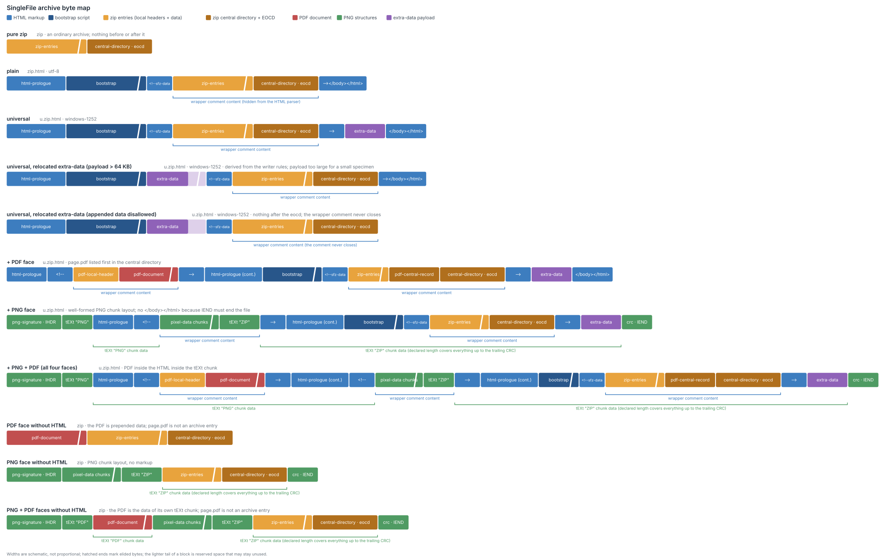
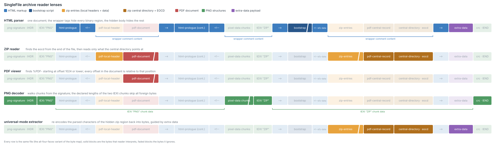

# The SingleFile archive format

**Status: draft.** This document specifies the SingleFile archive, the polyglot file
format produced by [SingleFile](https://github.com/gildas-lormeau/SingleFile) when it
saves a page as a ZIP archive. It is written against the reference implementation,
[single-file-core](https://github.com/gildas-lormeau/single-file-core) 1.5.119
(`processors/compression/`), and every byte-level statement has been verified on
generated specimen files.

The key words MUST, MUST NOT, SHOULD and MAY are to be interpreted as
described in [RFC 2119](https://www.rfc-editor.org/rfc/rfc2119) when, and only when,
they appear in all capitals.

Three kinds of statement appear throughout:

- **Format requirements**, in RFC 2119 capitals. Their subject is a writer producing an
  archive, or a *conforming reader of this format* — third-party software that reads
  SingleFile archives (§7). It is never the stock HTML, ZIP, PDF or PNG readers the
  document describes: those cannot be placed under an obligation by this document, and
  a requirement that appears to do so is describing what a writer must produce so that
  their existing behavior lands correctly (§4).
- **Reference behavior** — what `createArchive()` does where the format allows other
  choices. Always marked as the reference writer's, and never a requirement.
- **Measurements** — observed behavior of specific third-party software, with the
  version and the specimen it was measured on. §8 collects them; where one appears
  inline it is the evidence for a claim, not a guarantee about software in general.

## 1. Introduction

A SingleFile archive is **one byte string that is simultaneously a valid document in
several formats**. Every archive is a valid ZIP file containing the saved page and its
resources. Depending on the options used to produce it, the same byte string is also:

- a valid **HTML page** that extracts and displays the archived page when opened in a
  browser, with no external dependency;
- a valid **PNG image**, typically a screenshot of the page, though the format does not
  require the image to depict it;
- a valid **PDF document**, typically a rendering of the page, though the format does
  not require the document to depict it either.

Each format's reader accepts the file as a complete document of its own format and
silently ignores the bytes that belong to the other formats. The word is *accepts*,
not *conforms*: several faces lean on reader tolerances the target standards do not
promise (§1.1). The large payloads are stored once and
shared: the archive entries, the PDF document and the PNG pixel data are single
regions that several readers reach, not per-face copies. The polyglot works by
*partitioning* the file into regions and arranging each region so that every reader
either interprets it or skips it. What the optional features add is never a copy of
another face's payload: the text body (an optional plain-text copy of the page stored
in the HTML face for text tools and indexers, §4.6) repeats the page text, and the
image and PDF a writer supplies are separate documents, whether or not they depict the
archived page.

### 1.1 Design goals

The format exists to keep saved pages readable for as long as possible, with as
little software as possible. Each way of opening the file has a simpler fallback:

1. In a JavaScript-capable browser, the file opens and displays the page.
2. When extraction fails, the file displays an error message with recovery
   instructions. Without JavaScript, it renders as a blank page: the document body
   is hidden by construction, so the browser displays neither the page nor raw
   archive bytes (§4.1).
3. Renamed to `.zip`, the file opens in a ZIP tool; the page and each resource are
   ordinary entries. The two measured readers that refuse a self-extracting variant are
   named in the ranking below.
4. Renamed to `.pdf` or `.png` (when those faces are present), the file opens in a PDF
   viewer or an image viewer.

Three consequences shape everything below:

- **The HTML face depends on the ZIP face.** The HTML bootstrap extracts the page
  *from the ZIP structure of its own file*; the ZIP face is not an export feature, it
  is the storage layer the HTML face reads from.
- **Readers must need no cooperation.** Every face works with stock, unmodified
  readers. The format relies on two kinds of reader behavior: rules the target
  format actually defines (such as HTML's parsing and error-recovery rules, §4.1),
  and *customary tolerances* — behaviors that are near-universal in practice but
  that no standard promises, such as the backward scan ZIP readers use to find the
  End Of Central Directory record (§4.2, §5.2), the PDF header scan and
  trailing-data tolerance (§4.3), and PNG decoders' indifference to what an ancillary
  `tEXt` chunk contains (§4.4). The compatibility appendix records the customary
  tolerances' real-world support (§8).
- **The faces are not equally durable.** They rest on different amounts of unpromised
  behavior, and "the file is valid in four formats" is not four guarantees. A decision
  about what to rely on years from now should follow this order:
  1. **The ZIP face** is the one to trust, and the only one the format calls storage.
     A variant with no other face is an ordinary ZIP file. The self-extracting variants
     add prepended and appended bytes, which cost two measured readers: `ditto`, which
     requires a local header at offset 0, and `java.util.zip`, which rejects undeclared
     trailing bytes. A writer can fix the second case by declaring those bytes as the
     archive comment (§4.2).
  2. **The HTML face** rests mostly on *normative* behavior: HTML's tokenizer states
     and error recovery are specified, and the blank-page backstop of §4.1 is ordinary
     CSS. It is exposed on two other counts: it depends on the ZIP face beneath it, and
     a browser must run its script for the page to appear.
  3. **The PDF and PNG faces are conveniences.** Both rest entirely on tolerances no
     standard promises: the PDF header scan, where PDFium already enforces its
     1024-byte window exactly with no margin, and PNG decoders' indifference to a
     `tEXt` chunk holding bytes the format does not permit. They are worth having
     because they cost nothing the other faces need. For preservation purposes they
     are exports that happen to share the file; they are not archival copies.

### 1.2 Non-goals

- **Forward-only ZIP parsers.** Every archive with a face requires central-directory-driven
  reading, since the entries are then preceded by non-ZIP bytes. The variant with no other
  face is an ordinary ZIP file and streams from offset 0 like any other (§8.1, class A);
  parsers that require that are out of scope for the rest (§7).
- **In-place modification by generic ZIP tools.** The face invariants are global:
  the writer picks each hiding tag only after checking the exact bytes it must hide,
  the recovery payload of universal mode contains a checksum of the ZIP region
  without its comment-length field, and the PDF and PNG structures wrap the
  archive (§5.4). A tool
  that adds, removes or recompresses entries invalidates them, and most rewriters drop
  the prepended and appended regions outright. A generically rewritten file keeps at
  best its ZIP face. Editing an archive means producing a new one through the writer
  rules (§6).
- **Multi-page archives.** The reference implementation can bundle several saved
  pages into one archive behind a routing bootstrap (`multiPageArchive`). This
  version of the document specifies single-page archives only; the multi-page
  layout is out of scope.
- **Confidentiality outside the ZIP entries.** A password encrypts ZIP entry contents
  only (AES). The PDF and PNG faces render the page content and are plaintext by
  design; the writer withholds what it can without breaking a face, as described in
  §5.6. The embedded PDF MAY itself be a PDF-encrypted document, since the format is
  agnostic to the PDF's content, but the reference writer does not produce one.

### 1.3 Terminology

| Term | Meaning |
|---|---|
| **face** | One of the formats the file is valid in: HTML, ZIP, PNG, PDF. |
| **region** | A byte range with a single producer, named in §3. Regions are the units the rest of this document reasons about; a region can appear in several pieces — `html-prologue` resumes after the embedded PDF document in the PDF variants, and after the `tEXt "ZIP"` chunk header in the PNG ones, so with all four faces it comes in three. |
| **universal mode** | The variant whose HTML face can extract the archive from the *parsed page text*, the text and comment nodes the HTML parser produced, and therefore needs no access to its own raw bytes. Named "universal" because it works from any location, including the `file:` protocol. |
| **wrapper tag** | The HTML construct that hides a binary region from the HTML parser, `<!--`…`-->` by default (§5.1). |
| **appended data** | Bytes after the ZIP End Of Central Directory record. Readers tolerate them within the window their EOCD scan already covers: 65557 bytes from the end of the file (the 22-byte record plus the 65535-byte maximum comment length); "the 64 KB window" refers to this. It may be left undeclared or declared as the archive comment; both forms are valid ZIP and readers MUST accept both (§4.2). The recovery payload can be computed before that choice is made because it stops two bytes short of the record, excluding its comment-length field (see *recovered range* below). |
| **ZIP region** | The contiguous byte range holding the archive proper: from the first local file header the ZIP writer emitted through the last byte of the End Of Central Directory record. It spans the `zip-entries`, `pdf-central-record` (when present) and `central-directory · eocd` blocks of §3, and in the HTML variants it is the content of the last wrapper, exactly so on the element rungs and preceded by the `sfz-data` identifier on the comment rung, which the extractor steps over. It does **not** include `pdf-local-header` or the PDF document, which sit earlier in the file. |
| **archive** | The *logical* ZIP file: the set of entries the central directory describes, wherever their bytes lie. This is distinct from the ZIP region above, which is a contiguous byte range. Every entry but one has its bytes inside the region; `page.pdf` is the deliberate exception, an entry of the archive whose local header and data sit before the region (§4.2). "Archive" in this document always means the logical file, "ZIP region" always the byte range, and the two differ only in the PDF-with-HTML variants. |
| **recovered range** | What the universal extractor reproduces (§4.5): the ZIP region minus its last two bytes, the comment-length field of the End Of Central Directory record. That field is the one part of the record whose value depends on what follows the region, so leaving it out is what lets a writer decide the appended-data form after the recovery payload is final (§4.2). The extractor supplies the two bytes itself, as zeroes — the recovered range carries no comment. |
| **reference writer** | `createArchive()` in single-file-core `processors/compression/compression.js`. |
| **bootstrap** | The inline script in the HTML face that locates, extracts and displays the archived page. |
| **`sfz` identifiers** | Three byte-level identifiers carry the `sfz` prefix: `data-sfz`, `<sfz-extra-data>` and `sfz-data`. The prefix is inherited from SingleFileZ, the browser extension the format originated in (since merged into SingleFile), and is kept unchanged for compatibility with existing files. They are wire identifiers, not the format's name. Two of the three have a role in the format: `<sfz-extra-data>` is the element carrying the recovery payload, and `sfz-data` is the identifier the universal extractor addresses the ZIP region with — an `id` attribute on the wrapper element, or the first characters of the wrapper comment's data (§4.5). `data-sfz` is a marker the reference writer happens to put on the root element; this document mentions it only where it describes bytes those files contain. |

## 2. Variants: composing faces

Every SingleFile archive has the ZIP face. The other faces are enabled independently by writer
options, and compose. Each row of the table lists its complete option set; every row
also implies `compressContent`, the option that stores the page and its resources as
ZIP entries and so makes the output an archive at all:

| Writer options (core names) | HTML | PNG | PDF | Extension | Specimen |
|---|---|---|---|---|---|
| *(none)* | — | — | — | `.zip` | pure zip |
| `selfExtractingArchive` | ✔ | — | — | `.zip.html` | plain |
| `selfExtractingArchive`, `extractDataFromPage` | ✔ universal | — | — | `.u.zip.html` | universal |
| `selfExtractingArchive`, `extractDataFromPage`, `embeddedImage` | ✔ universal | ✔ | — | `.u.zip.html` | png |
| `selfExtractingArchive`, `extractDataFromPage`, `embeddedPdf` | ✔ universal | — | ✔ | `.u.zip.html` | pdf |
| `selfExtractingArchive`, `extractDataFromPage`, `embeddedImage`, `embeddedPdf` | ✔ universal | ✔ | ✔ | `.u.zip.html` | png-pdf |
| `embeddedPdf` | — | — | ✔ | `.zip` | zip-pdf |
| `embeddedImage` | — | ✔ | — | `.zip` | zip-png |
| `embeddedImage`, `embeddedPdf` | — | ✔ | ✔ | `.zip` | zip-png-pdf |

`extractDataFromPage` is orthogonal to the PNG and PDF faces. The PNG and PDF rows
include it because the clients producing those variants enable it by default, but
`embeddedImage` and `embeddedPdf` compose with a non-universal self-extracting file
just as well; the extension is then `.zip.html`. The one interaction: `page.pdf` lies
outside the ZIP region (§1.3), so the page-text extraction path does not recover it
with the rest. The extractor therefore filters that entry out unconditionally, on
every acquisition path including the ones that read raw bytes and could return it
(§4.5). In the last three rows there is no
HTML face, so the option does not apply. The *Specimen* column names the measured
reference files this document cites; §8 records how to regenerate them.

Notes on composition:

- **Universal mode requires the HTML face** (it is a property of the bootstrap) and is
  independent of PNG/PDF. The command-line client enables it by default whenever it
  produces a self-extracting file; the browser extension exposes it as the
  "self-extracting ZIP (universal)" file format.
- **The extra-data payload is what separates the two self-extracting types in
  practice.** A plain file has no way of its own to reach its bytes from a `file:`
  URL: the bootstrap has no payload to rebuild the archive from and does not attempt
  a self-read there (§4.1), so it goes to its error message. Opening one from disk
  needs cooperating software that reads the file and hands it to the bootstrap — the
  SingleFile extension does this once granted file access ("Allow access to file
  URLs" in Chrome, Edge and Brave; "Disable Local File Restrictions" in Safari). Over
  HTTP the plain file is self-sufficient, fetching its own URL. A
  universal file instead carries the extra-data payload (§3.1, §5.5), so the bootstrap can
  rebuild the archive from the parsed page text with no access to the raw bytes. Such a
  file opens from disk in any browser, with no setting and no assistance.
- **All four faces at once is a supported combination**: the PDF document rides
  inside the HTML head, which itself rides inside the PNG's first `tEXt` chunk
  (the all-four-faces row of the byte map).
- **Faces without HTML** are plain polyglots with no self-extraction and no markup:
  the ZIP data is appended after a raw PDF document (which is then plain prepended
  data), or wrapped in PNG chunks — or both, the PNG chunk layout carrying the PDF
  document as the data of its own `tEXt` chunk (keyword `PDF`) placed right after
  `IHDR`, which keeps `%PDF-` within the header scan window (§4.3). In none of
  these variants is `page.pdf` an archive entry.

### 2.1 The charset rule

The HTML face declares `<meta charset=utf-8>` when universal mode is off. When
universal mode is on it declares a single-byte charset instead — `windows-1252` in the
reference writer. The declaration MUST appear within the first 1024 bytes of the file
so the parser's encoding prescan finds it. That bound is the HTML standard's own
authoring rule. The prescan it serves is weaker than the rule suggests: the standard
makes it optional, and only *encourages* scanning the first 1024 bytes. Treat the
number as a ceiling to write under, never as a budget a parser promises to read. The
whole `<meta>` tag has to fit: one that straddles the boundary is not seen, and the
parser falls back to its default encoding. Meeting the declaration later, during
tokenization, does not rescue the file. The parser does not resume the prescan. It
re-navigates the document under the new encoding instead, and a writer must not rely
on that.

The declaration decides the decoding only when nothing outranks it. Three things do,
each returning an encoding with the standard's *certain* confidence, all of them ahead
of the prescan: a byte order mark, a user's explicit encoding override, and a charset
stated by the transport layer, which over HTTP means a `Content-Type` header carrying
its own `charset`. Any of the three replaces the declared charset, the parsed text is
then not what the writer encoded, and the region cannot be recovered from it. This is
the one precondition universal mode has that the file cannot satisfy from within
itself.

Where it bites is narrower than that makes it sound, because the parsed text is the
last rung, not the first. The bootstrap reads the file's raw bytes whenever it can
(§4.1), and raw bytes carry no encoding; universal extraction is the fallback for when
they are out of reach. Taking the three in turn:

- A **transport charset** exists only over HTTP, and over HTTP the raw read is what
  runs — the bootstrap requests its own URL and takes the response as bytes, which no
  `Content-Type` can reinterpret. It reaches universal extraction only in a double
  failure: the response has to defeat the raw read, through a network or CORS failure
  or a non-200 status, *and* state a charset of its own.
- A **BOM** is the writer's own doing. It is why universal and PNG variants never carry
  one (§3.1): the reference writer emits a BOM for the plain variant only
  (`includeBOM`), where nothing depends on the declared charset.
- A **user override** is the one no software can prevent, and the rarest.

On `file:` URLs the bootstrap goes straight to page-text extraction, since no raw read
is available there (§4.1) — but there is also no transport layer, so the first of the
three cannot arise on the very path that depends on the charset most.

The failure is safe rather than silent, which is why the precondition is worth stating
at all. Decoded under the wrong charset the reconstructed bytes are wrong, the payload
checksum does not match, and the extractor MUST fail to the error message (§4.5)
instead of displaying a corrupt page. A reader MAY tell the case apart from ordinary
corruption by comparing the encoding the document was actually decoded with —
`document.characterSet` in a browser — against the declared one, and say so in the
error message. Nothing requires it, and the MUST is unaffected either way.

Universal mode works in two parts, and the charset carries the first. The archive
bytes themselves are recovered *from the parsed page text*: the browser decoded
them as characters when it parsed the file, and the bootstrap re-encodes those
characters back into bytes. The requirement this places on the charset is
**injectivity**: under the encoding's index in the
[WHATWG Encoding Standard](https://encoding.spec.whatwg.org/) — the mapping every
browser implements — each of the 256 byte values MUST decode to a distinct code
point, and no byte may decode to U+FFFD. Any encoding with that property carries
arbitrary bytes through the parse, and 20 of the standard's encodings qualify (§8.4).
Multi-byte encodings, `utf-8` included, do not: invalid sequences collapse to U+FFFD
and the bytes cannot be recovered.

The reference writer uses `windows-1252`, for reasons beyond injectivity. It is the
best-supported single-byte encoding there is: the standard resolves the `iso-8859-1`
and `ascii` label families to it, and it is the fallback the HTML standard prescribes
for unlabelled content in most locales — so a file whose `<meta charset>` is stripped
or overridden by a server still tends to be decoded the way the extractor expects. It
also keeps the reverse table small, at 27 entries (§5.5).

The second part is the extra-data payload, which does **not**
contain the archive: it carries only what the round trip destroys, namely a checksum
and the information needed to restore newline bytes, which the parser normalizes.
The parser also replaces NUL bytes with U+FFFD; since no byte decodes to U+FFFD under
a qualifying encoding, the extractor maps U+FFFD back to NUL unambiguously and the
payload needs nothing for it (§5.5).

The declared charset governs the **whole document**, not only the regions the format
reasons about. Everything the parser reads is decoded with it, the bootstrap script
included, and the writer's own code is therefore subject to the same single-byte
decoding as the page it carries. In universal mode the bootstrap MUST contain no
character outside printable ASCII.

Unlike the `<title>` and the table of contents (§4.6), it cannot be rescued by
character references. A `<script>` element's content is script data, a tokenizer state
that does not resolve them: `&#9786;` written there stays seven literal characters and
reaches the program as seven characters. The escape has to happen one level down, in
the JavaScript source — `\u263A` rather than `☺`, an escape the language resolves when
the script is compiled, not one the HTML parser resolves when the file is read. A
minifier will undo this if allowed to, since printing the shortest form is its default
and the shortest form of `\u263A` is the literal character. A writer that assembles
the bootstrap through a minifier MUST configure it to emit ASCII only.

The consequence of getting this wrong is worse than the mojibake a raw title produces,
and that is the reason for the MUST. A garbled title is visible; a garbled string
inside the extractor is not. The reference writer shipped exactly this defect: its
inlined ZIP library carried a CP437 lookup table as literal characters, the page
re-decoded them as windows-1252, and the table grew from 256 entries to 508, shifting
every lookup past the first 32 by 60 positions. Only names decoded through that table
were affected — the ones whose UTF-8 flag was clear (§5.8), which in an archive of that
era meant `page.pdf` alone — and that was enough: its name is what the extractor matches
to skip it, so no archive with a PDF face extracted in any engine, while the page itself
looked correct. `page.pdf` now carries the flag like every other entry, so an archive
written by a current version has no name on that path at all; the requirement stands
regardless, because it is the bootstrap that is at stake and not one table inside it.

### 2.2 File name conventions

The reference implementation names files by variant: `.zip` (no HTML face),
`.zip.html` (self-extracting), `.u.zip.html` (self-extracting, universal). These are
conventions for humans and pickers; **readers MUST NOT rely on the file name**. Every
face is discoverable from the bytes alone: PNG and PDF by their signatures, the ZIP
face by its End Of Central Directory record, and the HTML face by an `<html` start tag
occurring before the first local file header — inside the first `tEXt` chunk's data in
the PNG variants, where the markup begins after the chunk's keyword. Inside the
archive, the `index.html` and `manifest.json` entries mark it as a saved page; a
reader should identify it that way (§7.1). The self-extracting variants are told apart
the same way: only a universal file carries an `<sfz-extra-data>` element.

## 3. The byte map

Unless a row states otherwise, the layouts below are measured from specimen files
saved from `example.com` (the generation commands are in §8); the
oversized-payload layout is derived from the writer rules instead, because a payload
over 64 KB requires an archive too large for a readable specimen. The figure below shows
the regions and their order; the glossary of §3.1 is the normative list, and it states
in text everything the figure conveys.



### 3.1 Region glossary

The names below are the block labels of the figure (where space is tight the figure
merges adjacent blocks into one label, such as `--></body></html>`). In this table,
*Producer* names
the syntax the bytes belong to (*extractor* marks the recovery machinery of
universal mode), and *Present* names the faces, variants or modes in which the
region exists. Rows are grouped: the HTML/ZIP core first, then the regions the PDF
face adds, then the regions the PNG face adds.

| Region | Producer | Present | Contents |
|---|---|---|---|
| `html-prologue` | HTML | HTML face | Doctype, the root element start tag, `<meta charset>`, an optional implementation-defined comment, title, optional head elements (canonical link, `robots` meta, viewport, Content-Security-Policy), minimal CSS, `<body hidden>`, wait/error messages, optional table of contents, optional text body (§4.6). The leading comment, the title, the canonical link and the text body are withheld when a password is set (§5.6). In the plain variant an optional UTF-8 BOM MAY precede the doctype (`includeBOM`); universal and PNG variants never carry one. In the PNG variants the region is split: everything through `<body hidden>` is the data of the `tEXt "PNG"` chunk, while the messages, the optional table of contents and the optional text body follow the `tEXt "ZIP"` chunk header; the doctype and the leading comment are dropped. |
| `bootstrap` | HTML | HTML face | One inline `<script>`: the embedded ZIP reader, the extractor, the display routine, and the content-acquisition logic (§4.1). In universal mode its bytes MUST be pure ASCII, since the declared charset decodes this region like any other and character references do not apply inside script data (§2.1). The wrapper start tag that opens the ZIP region follows it, directly or after a relocated `extra-data`. |
| `<!--` / `-->` | HTML | HTML face | The wrapper tag pair hiding a binary region from the HTML parser — comment tags by default, another pair when the hidden bytes defeat them — which `-->` is only the commonest way to do, the full test being `<!--`, `--!>` or a trailing `<!-` (§5.1). Drawn at each opening and closing position. The close tag is absent when appended data is prevented (`preventAppendedData`, or the `<plaintext>` wrapper which cannot close): no markup follows the archive and the wrapper runs to end-of-file. That does not mean the file ends at the EOCD — the PNG face's tail still follows, inside the wrapper, where it parses as text (§5.1). |
| `zip-entries` | ZIP | always | The archive's local file headers and entry data, written by the ZIP writer. The central directory of an archive written by the reference writer lists `index.html` (the page) first, then `manifest.json` (a JSON description of the archive: original URL, title, save time, resource-to-URL map — informative; the page displays without it), then the resources; the *physical* order of the local headers inside the region is not guaranteed to match, and readers MUST NOT rely on either order — entries are addressed by name (§7.1). |
| `central-directory · eocd` | ZIP | always | The central-directory records followed by the End Of Central Directory record. All offsets are absolute file positions (§5.3). In the HTML+PDF variants the EOCD accounts for the injected `pdf-central-record` (how the writer achieves that is §6). |
| `extra-data` | extractor | universal | `<sfz-extra-data>` element holding the base64, deflate-compressed recovery payload (§5.5). It always sits outside the wrapper, so it parses as a real element the extractor can address. Normal placement: after the EOCD, between the wrapper close tag and the end tags. Relocated placement, used when the payload exceeds the 64 KB appended-data window or `preventAppendedData` is set: immediately before the wrapper start tag. In the relocated form the element is followed by space padding: its room is reserved before the archive is written, because the region precedes the ZIP data and resizing it would shift every central-directory offset (§6). Neither placement carries positional meaning — the extractor finds the ZIP region by identifier, not relative to this element (§4.5). |
| `</body></html>` | HTML | HTML face | The end tags closing the document after the wrapper close tag. Omitted when appended data is prevented, and in the PNG variants so the file can end with the PNG tail. |
| `pdf-local-header` | ZIP | PDF face with HTML | The hand-built local file header for `page.pdf` (STORE, checksum precomputed, language encoding flag set as on every other entry — §5.8), written immediately before the PDF document so ZIP readers see an ordinary entry whose data is the PDF (§6). |
| `pdf-document` | PDF | PDF face | The raw PDF bytes. With the HTML face, wrapped together with `pdf-local-header` in a wrapper tag pair inside `html-prologue`, placed so `%PDF-` starts at offset 1024 or lower — the range PDF readers search for the header, which is what lets a PDF document start after other bytes at all (§4.3). Without the HTML face the file simply *starts* with the PDF document, as prepended data the ZIP face tolerates; `page.pdf` is then not an archive entry at all — no local header, no central record. |
| `pdf-central-record` | ZIP | PDF face with HTML | The central-directory record for `page.pdf`, injected *before* the writer's own central directory. The start of the central directory is the one place a record can be added without moving any offset the writer already committed, and it makes `page.pdf` the first entry ZIP tools list (§6). |
| `png-signature · IHDR` | PNG | PNG face | The 8-byte PNG signature and the `IHDR` chunk declaring the source image's dimensions — the first 33 bytes of the file. |
| `tEXt "PNG"` | PNG | PNG face with HTML | The length, type and keyword bytes of the first `tEXt` chunk. Its data is `html-prologue` (with the PDF face, the embedded PDF document rides inside it too), ending with the wrapper start tag. |
| `tEXt "PDF"` | PNG | PNG + PDF faces without HTML | The length, type and keyword bytes of a `tEXt` chunk whose data is the raw PDF document. Written only when the PNG and PDF faces combine without HTML — with the HTML face the PDF rides inside `tEXt "PNG"` instead — and placed right after `IHDR` so `%PDF-` stays within the header scan window (§4.3). |
| `pixel-data chunks` | PNG | PNG face | The source image's image-data chunks, copied unmodified. With the HTML face they sit inside the wrapper so the HTML parser skips them. |
| `tEXt "ZIP"` | PNG | PNG face | The length, type and keyword bytes of the second `tEXt` chunk. Its declared length covers everything from there up to but not including the trailing chunk CRC, as a PNG chunk length always does, so the PNG decoder skips the archive — and, with the HTML face, the bootstrap and the appended data — as the data of one chunk. With the HTML face, the wrapper opened at the end of `tEXt "PNG"` closes immediately after these bytes: its content is the first chunk's CRC, the pixel-data chunks and this chunk's own header, and the prologue resumes as markup directly after the close tag. |
| `crc · IEND` | PNG | PNG face | The `tEXt "ZIP"` chunk's CRC, computed once the archive bytes are final (§6), followed by the empty `IEND` chunk — the last bytes of the file (PNG requires `IEND` to end the stream, which is why the PNG variants drop the end tags). |

The reader-by-reader interpretation of these regions is §4; the mechanics that keep
them from colliding (wrapper-tag selection, checksums, offsets, the 64 KB budget) are
§5.

## 4. Reader lenses

Each consumer of the file has a defined way of locating its own bytes and a defined
reason to ignore the rest. This section walks the same file through each reader. The
figure shows the all-four-faces variant of the byte map once per reader, fading the
regions that reader ignores; the subsections explain each row.



This section describes what stock readers do with the file. The convention stated at
the head of this document applies throughout it: a MUST about a face constrains the
bytes a writer produces, never the stock reader whose behavior the format cannot
change.

### 4.1 The browser

The HTML parser consumes the whole file as one document. Its encoding prescan finds
the `<meta charset>` declaration within the first 1024 bytes (§2.1) and the file is
decoded as a single text; every binary region therefore also exists as characters in
the parsed document, which is what universal mode exploits (§4.5). This holds only
while the declaration is what decides the decoding: a BOM, a user override or a
transport-layer charset outranks it, and universal extraction then fails its checksum
rather than recovering anything (§2.1). The acquisition order below keeps that off the
common path — the raw bytes are read in preference to the parsed text wherever they
can be, and no encoding applies to them.

The binary regions are kept out of the rendered page by the wrapper tags. The
default wrapper is an HTML comment, and the HTML standard defines exactly which
character sequences terminate one (`-->`, and the recovery form `--!>`); the writer
MUST select a wrapper only after checking the bytes it must hide against that
wrapper's patterns (the exact rules differ between the ZIP region and the PDF and
PNG payloads, §5.1), so hiding relies on normative parsing behavior. When no
wrapper fits a PDF or PNG payload, the face is dropped rather than emitted bare
(§5.1). Some binary content always sits *outside* a
wrapper: in the PNG variants, the signature, IHDR and chunk framing bytes that
precede the root element start tag decode to a short run of text that HTML error recovery
places in the (hidden) body. The backstop for all these cases is the prologue: it
declares `<body hidden>` and a stylesheet that suppresses everything except the
wait and error messages, so the page comes up blank rather than showing raw bytes,
with or without scripting.

The bootstrap script runs at parse time and proceeds in three stages:

1. **Acquire the archive bytes.** On `file:` URLs it goes straight to page-text
   extraction (§4.5): whether a `file:` page may read its own bytes varies by
   browser and configuration (§2), so the bootstrap uses the rung that depends on
   neither. On other protocols it requests its own URL, aborting at the response
   headers: when the server advertises `Accept-Ranges: bytes` it switches to HTTP
   range reading, fetching only the central directory and the entries it needs (a
   large archive displays without downloading the ZIP region in full); otherwise it
   downloads the whole file. When the header probe fails it falls back to page-text
   extraction; so does a failure of the full download itself, past the probe, which
   is why the probe leaves the document in place. Only when every applicable rung fails does the error
   message appear, with recovery instructions that differ by variant (§2).
2. **Extract.** The embedded ZIP reader reads the archive through the ZIP lens
   (§4.2) and rebuilds the page: text entries are decoded, binary entries become
   in-memory URLs, and references between entries are rewritten deepest-first.
3. **Display.** The rebuilt page replaces the bootstrap document. Around this stage
   the saved page's `<noscript>` elements are neutralized — rewritten to inert
   placeholders before parsing, restored afterwards — because the page was captured
   with scripting available, so its noscript fallbacks must not activate in the
   viewer.

The entry point is exposed as a run-once `globalThis.bootstrap(content)` function,
so cooperating software MAY hand the bootstrap bytes it acquired itself; `content` is
the file's bytes as a `Blob` or an array of byte values, or a reader object exposing
the embedded ZIP reader's `readUint8Array` interface, and the call returns a promise
that settles when the page has been displayed. This is how
the SingleFile extension assists a *plain* (non-universal) file on `file:`: granted
file-URL access, it reads the file and invokes the bootstrap. That is the recovery
path the plain variant's error message describes.

### 4.2 The ZIP reader

The ZIP face is read from the end. A reader locates the End Of Central Directory
record by scanning backward from end-of-file; the format guarantees it lies within
the window every reader must already scan to support archive comments (§1.3,
*appended data*), because everything after it — wrapper close tag, extra-data, end
tags, PNG tail — fits the appended-data budget (§5.2). Accepting *undeclared* bytes
in that window is itself a customary tolerance (§1.1): the ZIP specification
documents the comment, not trailing junk. From the EOCD
the reader jumps to the central directory and reads only what it references;
central-directory-driven reading is a requirement of the format (§1.2, §7).

Two properties keep ordinary ZIP tools comfortable:

- **Offsets MUST be absolute file positions** (§5.3). The stored central-directory offset
  equals the record's actual position, and each entry's local-header offset points at
  a real local header — tools that cross-check offset arithmetic (rather than
  tolerating a uniform shift from prepended data) accept the file as-is.
- **The non-ZIP regions are invisible to the reader.** Bytes before the first local
  header and after the EOCD are simply never referenced. The one deliberate
  exception: in the PDF-with-HTML variants the first central-directory record points
  *back into the HTML head*, where the hand-built `page.pdf` local header and the PDF
  document sit (`pdf-local-header`, §3.1) — an ordinary STORE entry that happens to
  live inside the prepended region.

A listing shows `page.pdf` first (when the PDF face is present with HTML), then
`index.html`, `manifest.json` and the page's resources. That order and the two
conventions below describe the reference writer rather than constraining the format —
readers address entries by name (§7.1):

- Entries for resources fetched from a URL carry that URL in their *comment* field; a
  resource that came from a `data:` URL carries the literal marker `data:` instead,
  and `manifest.json` and `page.pdf` have no comment. Comments are omitted entirely
  from a password-protected archive, because the central directory is not encrypted
  (§5.6).
- Entries whose content is already compressed (images, fonts, media, PDF) are STOREd
  and the rest are deflated, a size optimization no reader depends on.

One rule here is a requirement. With a password, entry contents are AES-encrypted —
except `page.pdf`, which MUST stay unencrypted and MUST be STOREd, because its bytes
double as the PDF face (§5.6). The encryption is WinZip's AES scheme, the one ZIP
tools implement under compression method 99 with the `0x9901` extra field: AE-2,
AES-256, PBKDF2-HMAC-SHA1 key derivation and an HMAC-SHA1 authentication code. A
reader that already supports encrypted ZIP entries needs nothing specific to this
format, and the [WinZip AES specification](https://www.winzip.com/en/support/aes-encryption/)
is normative for it. A reader implementing the scheme from primitives rather than from
a ZIP library needs six parameters that specification supplies and this paragraph's
names do not: 1000 PBKDF2 iterations; a 16-byte salt at AES-256 strength, stored
before the data; a derived key of 32 + 32 + 2 bytes, read as encryption key,
authentication key, then a password verifier the reader MUST check before decrypting;
the HMAC-SHA1 code truncated to its first 10 bytes and stored after the data; and a
CTR counter that increments **little-endian**, starting at 1, which general-purpose
CTR interfaces do not do.

Appended data comes in two forms and both are valid ZIP, so readers MUST accept
both. **Raw** — the EOCD declares a zero-length comment and the trailing bytes are
simply outside the archive — is the default, because tools print a declared archive
comment on ordinary operations (§8.1), and in universal mode that comment is the
whole base64 recovery payload. **Declared** — the EOCD's comment length covers every
byte after the record — is what older writers emitted, and it is the only form some
readers accept at all: `java.util.zip`, and therefore Android and most JVM tooling,
rejects an archive with undeclared trailing bytes outright (§8.1). A writer SHOULD
offer both and default to raw.

Neither form constrains the other faces, and universal mode supports both, because
the recovery payload describes the recovered range rather than the whole region: the
comment-length field is excluded (§1.3), so its value can be decided after the
payload is final. A writer that instead covered the field would have to solve a
circular dependency — the field's value depends on the size of the appended run,
which contains the payload, whose content depends on the field.

### 4.3 The PDF viewer

The PDF face relies on two customary reader behaviors — conventions PDF
implementations follow rather than guarantees of the PDF specification, so the
compatibility appendix records real-world support (§8):

- **The header scan.** Viewers accept a file whose `%PDF-` header starts at offset
  1024 or lower — the bound is on the header's first byte, and 1024 itself passes —
  and treat the header's position as byte 0 of the document: every
  offset in the file (cross-reference entries, `startxref`) is interpreted relative
  to it. The writer MUST place the header inside that window; the document's own
  offsets then need no rewriting. Engines differ in how strictly they hold to the
  1024-byte figure, and the strict ones are the common ones: PDFium — Chrome, Edge and
  everything else Chromium-based — accepts a header starting at offset 1024 and
  rejects one at 1025 outright, while poppler and macOS PDFKit impose no limit at all
  (§8.1).
- **Tolerance of trailing data.** The archive continues after `%%EOF`, so the
  document's tail is not the file's tail. Viewers cope by searching backward for the
  trailer over a larger window or by reconstructing the cross-reference table from
  the objects themselves.

With the HTML face, the PDF document sits inside the head, wrapped in its own
wrapper-tag pair chosen against the PDF's bytes (a PDF containing `-->` steps the
ladder, §5.1), and preceded by the `page.pdf` local header so the same bytes are also
a ZIP entry. That dual role is why the entry MUST be STOREd and MUST NOT be
encrypted: a viewer reads the entry's data region directly, and any transformation
of it would break the face. Without the HTML face the document needs no wrapper, and
where it sits depends on the PNG face: alone with the ZIP face it simply starts the
file, at offset 0, exercising only the trailing-data tolerance; with the PNG face it is
the data of a `tEXt "PDF"` chunk placed right after `IHDR` (§3.1), which puts `%PDF-`
at roughly offset 45, inside the window but not at its start.

### 4.4 The PNG decoder

PNG offers no header scan: the standard requires the signature to be the first
8 bytes of the stream and `IEND` to be its last chunk. The PNG face therefore owns
both ends of the file — the HTML face gives up its doctype and leading comment
at the front, and the closing `</body></html>` at the back (§3.1).

After the signature, a decoder walks chunks — length, type, data, CRC — and skips
ancillary chunks it does not use. The face hides all foreign bytes inside two `tEXt`
chunks (ancillary by construction, their type starting lowercase):

- **`tEXt` with keyword `PNG`** carries the head of the HTML prologue, through
  `<body hidden>` — and, in the all-faces variant, the embedded PDF document inside
  it — ending with the wrapper start tag. The rest of the prologue, the messages and
  the optional text body, comes later, inside the second chunk.
- **`tEXt` with keyword `ZIP`** declares a length that covers everything from its
  keyword to the trailing chunk CRC: the rest of the HTML, the bootstrap, the whole
  ZIP region and the appended data. The decoder hops over all of it as the data of
  one chunk.

The `tEXt "ZIP"` chunk carries text the PNG standard does not strictly permit: a
`tEXt` text string is Latin-1 text, and its payload contains NUL bytes — 78 in the
`png` specimen, 101 in the `png-pdf` one. The first chunk is pure printable ASCII in
the plain `png` specimen, where the doctype and the provenance comment are suppressed
and the title is escaped to character references; only the `-pdf` variants put NULs
in it. Decoders skip
ancillary chunks without inspecting their text, so this passes everywhere tested
(§8.1). It exercises the PNG tolerance §1.1 lists at its limit: what decoders ignore
in a `tEXt` chunk is text PNG does not permit.

Both chunks MUST carry correct CRCs — decoders are entitled to verify them, and the
second chunk's CRC can only be computed once the archive bytes are final (§6). The
`pixel-data chunks` region is copied bit-identically from the source image, so the
decoded image is exactly that image.

### 4.5 The universal-mode extractor

The last reader is the format's own: the extraction path of universal mode, used
when the raw bytes are unreachable (§4.1). Its input is not the file but the *parsed
document* — the characters the HTML parser produced — and its output is the ZIP
region reconstructed byte for byte, with one deliberate exception: the two bytes of
the EOCD comment-length field, which the payload does not describe and the extractor
always writes as zero (step 2 below, and the row in §7.4).

It works in three steps:

1. **Locate.** The extractor finds the `<sfz-extra-data>` element for the payload, and
   the ZIP region's node by its identifier `sfz-data` (§1.3): the element returned by
   `getElementById`, or, when the wrapper is a comment, the first comment in the
   document whose data starts with those characters. An element bearing the identifier
   wins over a comment when both resolve; a reader that finds an id-bearing element
   which is not one of §5.1's wrapper rungs SHOULD fall back to the comment, since the
   `id` is then something else in the page. The two placements (§3.1) need no
   telling apart, and neither the region's position in the tree nor its depth carries
   meaning — a document that moved the node before extraction resolves the same way,
   which matters because the reference extractor relocates `meta` and `style` elements
   into the head before this step and one wrapper rung is a `style` element. With a
   comment wrapper the identifier is part of the node's data, so the re-encoding in
   step 3 starts after it.
2. **Decode the payload.** The element's text is base64 of a raw-deflate stream, and
   the writer puts nothing else inside the element — the padding of the relocated
   placement sits outside it (§6.1) — though a reader SHOULD ignore whitespace there
   rather than reject the file. It
   inflates to four fields: a checksum of the recovered range, its byte length, the
   newline count, and the packed sequence of 2-bit codes recording each original
   newline (LF, CR or CR LF). §5.5 gives their wire format — little-endian 32-bit
   words, the codes packed 16 per word, least-significant pair first — which a reader
   needs before it can read any of what follows.
   Every one of the four describes the *recovered range*,
   not the whole ZIP region: a newline formed by the two excluded bytes is neither
   counted nor coded, and the checksum does not cover them. The declared length is the
   **only** bound on the re-encoding: the extractor MUST stop there and append two zero
   bytes to complete the EOCD record.
   Those two bytes are its comment-length field, and only that field: every other byte
   of the record is reconstructed from the parsed text like the rest of the region. The
   field is excluded because its value depends on what follows the region, so a payload
   covering it could not be computed until the appended data was final (§1.3); a
   recovered archive therefore always declares a zero-length comment, whatever the
   original declared. Never infer the bound from the node instead: the wrapper's close tag is
   absent whenever appended data is prevented, and under `<plaintext>` the node always
   runs to end of file. The final word is padded to 16 codes,
   so codes beyond the declared newline count carry no meaning and a reader MUST ignore
   them; within the count, the value 3 is unassigned and a reader MUST reject a payload
   that uses it.
3. **Re-encode the characters.** Apply the inverse of the declared charset, exactly
   as §5.5 defines it: a character whose code point is a byte value that decodes to
   itself becomes that byte, every other code point goes through the reverse table,
   and U+FFFD becomes NUL. Under windows-1252 this is nearly an identity — 229 of the
   256 values map to themselves — but the shortcut "any code point ≤ 255 is that
   byte" is **not** a valid substitute: under other qualifying charsets (§2.1) code
   points below 256 can belong to a different byte, 75 of them under `macintosh`, and
   the shortcut would silently corrupt the region. The two things parsing destroyed
   are restored from the payload: each parsed newline consumes the next 2-bit code to
   reproduce the original byte sequence.

In the PDF-with-HTML variants the recovered region is a complete archive except for
one entry: its central directory still lists `page.pdf`, but that entry's local
header and data sit in the HTML head, outside the ZIP region (§1.3). The extractor
skips the entry instead of failing — the displayed page never references it, and
the PDF stays reachable through every raw-bytes path (§4.2).

The entry's offset is unusable *within the recovered region* — it is a true file
position like every other (§5.3), and a reader of the whole file follows it normally;
what fails is only the shifted arithmetic of the paragraph below. Its bytes are not out
of reach either: the local header
and the document sit in a wrapper in the head, so they are in the parsed page like any
other region, and a reader MAY recover them by the same round trip — find a local file
header naming `page.pdf` among the other parsed nodes, take the declared number of
bytes after it, and check them against the CRC-32 the central directory holds. The CRC
check is mandatory. The recovery payload's newline codes cover the ZIP region only, so
a newline in the PDF block has no code and its original bytes must be guessed: assume
LF, the byte the parser normalized *to*. A PDF routinely contains CR, so the guess
often fails, and nothing may be written unless the CRC-32 agrees. Take the length from
the central-directory record, which is the entry's authority for it; the hand-built
local header of §6.1 carries the same value, but a reader cannot tell that from a
length deferred to a data descriptor. A matching CRC-32 is a 32-bit non-cryptographic
check over a reconstruction that differs from the original in at most a few newline
bytes, so an undetected error is improbable but cannot be ruled out. A reader MUST NOT
present a reconstructed `page.pdf` as verified, and MUST NOT let one displace bytes
obtained from a raw-bytes read.

Recovering the entry is therefore optional; the reference extractor skips it, which
conforms. A reader that *presents the archive's contents* — a listing, an
extract-to-disk, an entry enumeration offered to a caller (§7.1) — MUST report
`page.pdf` as present and unretrieved rather than omit it, whether it skipped the
recovery or tried and failed the CRC check. Its listing is then the same as a raw-bytes
reader's, with only the bytes missing. A reader that has no such surface is outside the
rule: the display path of §4.1 rebuilds a page from the entries it needs, `page.pdf` is
referenced by nothing in that page, and the reference extractor accordingly filters the
entry out on every acquisition path, including the ones that read raw bytes and could
return it.

The extractor MUST verify the three checkable payload fields — byte length, newline
count and checksum — and fail to the error message on any mismatch. It MUST also fail
on the unassigned newline code of step 2 rather than decode it, so that a payload
written against a later revision of the format is named as unsupported instead of
silently reconstructing the wrong bytes.

The recovered region is a complete archive but **not an offset-self-contained one**.
Its offsets are still absolute positions in the original file (§5.3), so every
local-header offset in its central directory, and the central-directory offset in its
EOCD record, overshoot by exactly the region's start position in the file. A reader of
the recovered region MUST therefore apply a uniform negative shift of that amount, the
prepended-data compensation ZIP readers already implement: from the region's point of
view the missing bytes look like a prefix that was stripped. In the
specimen of §8.2 the shift is 122005 bytes: Info-ZIP reports `missing 122005 bytes in
zipfile`, adds `(attempting to process anyway)` and lists both entries, while readers
that compensate silently, such as Python's `zipfile`, show no diagnostic at all. The
shift also puts `page.pdf` out of the
offset-following path: its local header lies *before* the region, so its compensated
offset is negative (−102092 in the `pdf` specimen) and no reader can seek to it. On
success the shifted bytes enter the normal extraction path (§4.2).

The shift is a file offset, and a universal-mode reader has no file. It does not need
one: the region carries the shift within itself, since its EOCD declares both the size
of the central directory and its absolute offset, while the directory's position inside
the region is known. With `region` the recovered bytes,

```
shift = eocd.centralDirectoryOffset - (eocdPosition - eocd.centralDirectorySize)
```

where `eocdPosition` is the EOCD record's own offset within `region`, found by scanning
backward for its signature the way any ZIP reader finds it. A reader arrives at the
same number as a ZIP library's prepended-data compensation, which derives it from the
record's position rather than from the buffer's end. Do not substitute
`region.length - 22` for `eocdPosition`: the two are equal only when the EOCD is the
last record in the region, which a non-empty archive comment breaks. Zip64 does not —
its records precede the EOCD, which stays last.

Under zip64 (§5.7) both of those EOCD fields are the `0xFFFFFFFF` sentinel, and the
zip64 end of central directory record carries the real values. Take them from there,
using the same `eocdPosition` arithmetic against that record's own position — the
zip64 locator states an absolute offset in the original file, so it needs the shift
this formula produces and cannot be used to find it. A reader that instead uses the
sentinels arithmetically gets a shift in the billions, with no diagnostic.

### 4.6 Text tools

The optional text body (`insertTextBody`) addresses one more consumer: software that
reads the file as plain text — `grep`, desktop search, indexers — and will never run
the bootstrap or unzip anything. It is a `<main hidden>` element at the end of the
visible prologue holding the page's text content, so the page stays searchable
without any extraction. It is searchable by everyone, so it is not written at all
when a password is set (§5.6): its text would be readable without the password.

The text body is always written in UTF-8, regardless of the declared charset. In
universal mode this cuts its audience in two: a charset-oblivious tool that reads
raw bytes — `grep`, plain-text search — sees intact UTF-8, while any consumer that
honors the declared `<meta charset>` decodes it as windows-1252 and garbles
non-ASCII text. That includes the HTML parser itself — harmless there, because the
region is hidden and replaced (§4.1) — but also HTML-aware indexers. In universal mode the text body
opens with the page title, for the same raw-byte
audience — it is the first *text* in the element, which is not necessarily the
element's first line: the reference writer's serialization puts a newline before it.
Outside universal mode the title is not repeated there, since the prologue's own
`<title>` is already readable as bytes.

The `<title>` element takes the opposite route, and so does every other piece of
prologue text the writer assembles itself. Character references are resolved against
Unicode independently of the declared encoding — in RCDATA, where the title's content
sits, in ordinary element text, and in attribute values alike — so the writer emits
every character outside printable ASCII, along with `&`, `<`, `>` and `"`, as a
numeric reference. Those bytes are therefore pure ASCII and the text survives the
single-byte declaration intact: a page titled 日本語 shows as 日本語 in the browser tab
and to any conforming parser. The reference writer passes the title and the multi-page
table of contents — its link text and its `href` values, which is what the `"` is for —
through one shared escaper. Writers that emit such text raw MUST NOT do so in
universal mode, where the same bytes decode as mojibake.

The text body above is the deliberate exception, not an oversight: it is left as raw
UTF-8 because its audience reads bytes rather than parsed text. The bootstrap script
is the other region outside this rule, and it is outside for a harder reason — script
data does not resolve character references at all, so the escape must happen in the
JavaScript source instead (§2.1).

## 5. Cross-cutting mechanics

Section 3 named the regions and §4 read them one reader at a time. What remains are
the rules that span readers: how a payload is hidden, how much room is left at the
end of the file, which numbers are offsets into what, what each checksum covers, how
the character round trip is inverted, what a password protects, and what changes when
the archive is large enough to need zip64.

### 5.1 Wrapper-tag selection

Binary payloads inside the HTML face are hidden by a wrapper tag pair. What the format
requires of a wrapper is that the HTML parser not treat its content as markup, so the
payload survives parsing as text, and that the payload not contain the construct's
terminator. Any construct with those properties works; the reference writer picks from
this ladder, in order:

| Order | Wrapper | Parser treatment of the content | Terminated by |
|---|---|---|---|
| 1 | `<!--` … `-->` | comment | `-->`, or the recovery form `--!>` |
| 2 | `<script type=sfz-data>` | script data, not executed (the type is not a JavaScript MIME type) | `</script` followed by whitespace, `/` or `>` |
| 3 | `<style type=sfz-data>` | raw text, no style sheet built (the type is not a CSS MIME type) | `</style` + delimiter |
| 4 | `<noframes>` | raw text | `</noframes` + delimiter |
| 5 | `<noembed>` | raw text | `</noembed` + delimiter |
| 6 | `<iframe>` | raw text | `</iframe` + delimiter |
| 7 | `<xmp>` | raw text | `</xmp` + delimiter |
| 8 | `<svg><![CDATA[` … `]]></svg>` | CDATA section | `]]>` |
| 9 | `<plaintext>` | everything to end of file | nothing — the element cannot be closed |

The terminators are written lower case above, but HTML matches end tag names ASCII
case-insensitively: `</XMP>` and `</Script ` close their elements just as `</xmp>` and
`</script>` do. A writer's test MUST be case-insensitive, on the start patterns as well
as the end ones. A stored, uncompressed resource is the realistic source of an
upper-case one.

Every rung hides its content unconditionally. `<noscript>` has the right terminator
and was a rung until core 1.5.108, but it is the one construct whose content is raw
text only while scripting is enabled and markup when it is not, so on a page opened
without scripting the archive bytes would reach the tree builder as tags. The rungs
below it hide the same payloads at no extra cost, so it was removed rather than
demoted.

The order under the comment is not arbitrary. Every rung hides its content from an HTML
parser, but text extractors differ, and the ZIP region is large enough that the
difference is a user-visible one. Measured on macOS: Spotlight's HTML importer indexes
the content of `<noframes>`, `<noembed>`, `<iframe>`, `<xmp>` and `<plaintext>`, and
`textutil` reads the last two of those, `<xmp>` and `<plaintext>`, while the comment
and the `script` and `style` rungs are dropped by both. Those two therefore sit
directly under the comment, so that an escalating writer keeps the archive out of the
reader's local search index
for as long as the payload allows. Both are inert at those types: the script is not
executed and no style sheet is built.

That ordering is the one place the format optimizes against measured third-party
behavior rather than against a rule, and unlike the tolerances of §1.1 nothing depends
on the measurement holding. An extractor that starts reading `<script type=sfz-data>`,
or stops reading `<xmp>`, changes only which archives end up in a local search index;
every rung still hides its content from the HTML parser, and a writer whose ladder is
ordered differently produces files that are just as correct.

The CDATA rung sits where it does for the same reason, and it is the only rung whose
placement understates it. A CDATA section is a CDATA section only in foreign content,
which is what the `<svg>` element is there for — in HTML content `<![CDATA[` is a
bogus comment, and the payload would be markup. Given the `<svg>`, the construct is the
strongest on the ladder: `]]>` is the whole of its terminator, and it is a sequence real
payloads carry far less often than `-->` or `</script>`. That matters most for the one
thing the ladder cannot otherwise avoid — an archive nested inside another as a face
carries the terminator of every rung it climbed, so each rung is spent once and only
once (§5.1, ladder depth). A writer MUST place the identifier on the `<svg>` element and
not on the markup declaration, which takes no attributes: `<svg id=sfz-data><![CDATA[`.

Two properties of the CDATA section state are worth stating because a writer is tempted
to guard against both and needs neither. Sections do not nest, so a `<![CDATA[` inside
the payload is text like any other — the start-pattern test on this rung is the same
conservatism the raw-text rungs get, not a necessity. And trailing brackets are safe: a
payload ending `]]` against the writer's `]]>` produces `]]]]>`, and the tokenizer's
CDATA section end state emits the payload's own two brackets before closing, so the
recovered bytes are exact.

Verified in Blink, Gecko and WebKit, and against html5lib: a universal-mode archive on
this rung recovers from the parsed document byte for byte, with the checksum of §4.5
matching, indistinguishably from the same archive on the comment rung. The same probe
covered a payload holding every byte value, every rung's patterns, and the near-misses
`]]x>`, `] ]>`, `]>` and `]]`, in both the prologue position and mid-document.

Two things about the ladder *are* required. Whatever order a writer gives the eight
closable rungs, it MUST apply the selection test below to every rung it considers, and
MUST keep `<plaintext>` available as the rung of last resort: §6.2's termination
argument needs one rung no payload can defeat.

The wrapper of the ZIP region also carries the identifier the extractor addresses it
with (§4.5): an element rung takes it as an `id` attribute — `<script type=sfz-data
id=sfz-data>`, `<noframes id=sfz-data>` — and the comment rung as the first characters of
its data, `<!--sfz-data`. The wrappers hiding the PDF and PNG faces MUST NOT carry it:
those payloads are found by byte structure, and a second node bearing the identifier
would shadow the archive.

The reference writer walks the ladder from the top and takes the first rung the payload
does not defeat. The test it applies is the format's, and is the same for every payload;
what differs is how far the ladder goes:

- **The ZIP region** rejects a rung whose *end* pattern the payload contains, and also
  a rung whose *start* pattern it contains. A rung's start pattern is the tag's opening
  delimiter and name, without attributes: `<!--` for the comment, then `<script`,
  `<style`, `<noframes`, `<noembed`, `<iframe`, `<xmp` for the elements, and
  `<![CDATA[` for the CDATA rung.

  `<plaintext>` is exempt from **both** tests. It has no terminator to occur and no
  tokenizer states to escape into — a `<plaintext` inside a `<plaintext>` is inert
  text like everything else — so no payload can defeat it. §6.2's termination argument
  rests on that exemption.

  The other eight are all tested, and a writer MUST test all eight rather than the one
  that needs it. The `<script>` rung needs it
  to be correct at all, because script data has escape states no other rung has: `<!--`
  in script data enters *script data escaped*, and a `<script` after that enters *script
  data double escaped*, where `</script>` does **not** close the element. So a payload
  can hold `<!--` and then `<script`, contain no `</script` anywhere, pass the end test —
  and the wrapper then swallows its own end tag, the extra-data element and the rest of
  the document. On the other seven the start test is genuine conservatism: a nested `<!--`
  is a parse error inside a comment but does not close it, and the raw-text rungs hold a
  flat run of characters with no states at all, while CDATA sections do not nest. The
  rule is uniform deliberately: the
  exemption would save one pattern match per rung on bytes already in memory, at the
  cost of a special case an implementer has to remember correctly about the single rung
  where forgetting it destroys the document. An earlier draft offered exactly that
  latitude, in the broader form "a writer MAY skip the start test outside universal
  mode", and the reference writer's PDF and PNG faces took it and shipped the bug
  (§8.5).
- **The PDF and PNG payloads** apply the same two tests, for the same reason — a face
  that took the `<script>` rung on a payload holding `<!--` and `<script` would swallow
  the rest of the document, title, bootstrap and extra-data element included — but the
  `<plaintext>` rung is excluded from their ladder: those payloads sit in the middle
  of the file, so a wrapper that can never close is not an option. When no rung fits,
  the writer MUST omit the face and emit the archive without it. It MUST NOT write the
  payload bare. Bare renders acceptably — the blank-page backstop of §4.1 keeps it
  invisible — but the payload's markup joins the document, and a payload that is itself
  a SingleFile archive then contributes an `sfz-data` node ahead of the file's own. A
  reader looking for one node finds two, takes the first, and returns an archive that
  passes every check it has (§7.4). A face is a convenience; the archive is not.

The comment rung has one restriction more than a terminator. HTML forbids comment text
that *starts* with `>` or `->`, and the tokenizer enforces it: it closes the comment
right there, spilling the payload into the parser. What starts the comment differs by
payload — the ZIP region begins with the identifier, the PDF face with a local file
header or `%PDF-` — but the PNG face begins with the CRC of the chunk carrying the
start tag, four bytes that are only settled once the tag is chosen, and one in 256 of
them is `>`. A writer using a comment there MUST compute that checksum and leave the
comment rung when it opens with `>` or `->`. It MUST leave it by *resuming the rung
search* below it, not by taking the rung that follows: the checksum says only that the
comment is unusable, and which rung is usable remains the payload's to say. The test
itself cannot cascade — only the comment rung carries the restriction, and every rung
below it is an element — but the payload's terminators still apply, and a payload
holding `</script>` sends a writer that stepped rather than searched onto the one rung
it is guaranteed to close. HTML also forbids comment text ending
with `<!-`, which the terminator check covers by testing that pattern anchored at the
payload's end.

Choosing the last rung has consequences that reach the rest of the file: because
`<plaintext>` cannot be closed, selecting it sets `preventAppendedData` — no *markup*
may follow the ZIP region, which forces the relocated placement of the extra-data
element (§5.2) and drops the closing `</body></html>`.

That constraint is about markup, not about the last byte of the file, so the PNG face
composes with this rung: the `tEXt` chunk's checksum and the `IEND` chunk still follow
the region, as the PNG face requires, and `<plaintext>` reads them as the text they are.
Verified on a build forced onto this rung with a screenshot embedded: the file ends
`49 45 4e 44 ae 42 60 82`, decodes as a PNG, and its archive extracts from the parsed
page. The termination argument of §6.2 therefore holds for the faced variants too.

The ladder has a depth, and nesting reaches it. An archive used as the PDF or PNG
payload of another one carries the terminator of every rung its own faces climbed
through, and `-->`, `</script>` and `</style>` besides, which every prologue emits.
Each level of nesting therefore burns exactly one rung, and the eight a face may use
run out at the sixth: the reference writer selects `<!--`, then `<noframes>`,
`<noembed>`, `<iframe>`, `<xmp>`, the CDATA rung, and then has nothing left. No ladder
of fixed length avoids this; adding a rung moves the limit by one level, which is the
limit of what the CDATA rung buys here — its value is that real payloads rarely hold
`]]>`, not that it makes nesting unbounded. That is why the paragraph
above states a MUST rather than a quality-of-implementation preference — exhaustion is
reachable by construction, not only by a payload built to provoke it.

The check MUST be made against the payload's final bytes, for every payload the
writer hides and in every variant that hides one. Every rejection restarts the build
(§6): the wrapper choice changes the bytes preceding the archive, so the archive must
be rewritten at its new position.

### 5.2 The appended-data budget

Everything the writer emits after the EOCD record MUST fit in 65535 bytes — the
maximum length a ZIP archive comment may declare, and therefore the distance beyond
the record that every reader's backward scan already covers (§1.3). The appended run is:

```
wrapper close tag + extra-data element + end tags + (PNG face: 4-byte chunk CRC + 12-byte IEND)
```

and the writer compares its total against 65535 before committing to it. The EOCD
record's own 22 bytes sit inside the window too, giving the 65557-byte figure of §1.3.

Only the extra-data element can outgrow the budget: it carries one 2-bit code per
newline sequence in the recovered range — the ZIP region without its comment-length
field (§4.5), CR LF counting once, for two bytes (§5.5) — so it
grows with the archive. Newline bytes
occur at their natural density in compressed and STOREd binary data — about two in
every 256 bytes — and the codes are compressed and base64-encoded, which measures at
one byte of element per 650 bytes of archive at scale (§8). The budget is therefore
exhausted at an archive of roughly 40 MB, so the relocated placement is rare in
practice. That ratio is the large-archive limit and must not be used to size a
particular file: deflate's overhead is a fixed cost spread over a growing payload, so
small archives are far less efficient. Measured on exact byte counts, a 6099-byte region
needs 69 bytes of element — a ratio of 88 — and a 74057-byte region needs 189, a ratio
of 392; §8.3's series then runs 475, 609, 650 and 646 as the archive grows from 86 KB to
4.2 MB, so the ratio approaches the headline figure from below and levels off rather
than climbing past it. A writer sizes its reservation from the payload it actually
produced (§6.2), never from this figure. When the payload does not fit, or when
`preventAppendedData` is set, the writer switches to the **relocated placement**: the
element moves in front of the wrapper start tag, ahead of the archive (§3.1). Room
for it MUST be reserved before the ZIP region is written, because inserting bytes
ahead of the archive would shift every offset the ZIP writer has already committed;
the reservation is padded with spaces and the real payload is written into it once
its final size is known (§6).

### 5.3 Offset bookkeeping

Three coordinate systems coexist in one file, and the format's job is to keep each
self-consistent:

- **ZIP offsets are absolute file positions.** The writer is told the size of
  everything already emitted before the first local header, so the central directory
  offset in the EOCD and every local-header offset in the central directory are true
  file positions (§4.2), so a reader of the *whole file* never needs prepended-data
  compensation — the repair by which a reader recomputes offsets that disagree with
  the file size. A reader of the recovered ZIP region alone does need it (§4.5).
- **PDF offsets are header-relative.** The document's own cross-reference offsets are
  interpreted from the `%PDF-` header, so embedding it needs no rewriting; the writer
  only MUST keep the header inside the scan window (§4.3).
- **PNG has no offsets, only lengths.** Each chunk declares its data length. The
  `tEXt "ZIP"` chunk's length covers the whole archive, and the appended data too in
  the variants that have it, so it can only be written once the file's final size is
  known, and the writer patches it in place at the end (§6). It is the second chunk
  only when the HTML face is present; without it there is one `tEXt` chunk and no
  appended data.

The injected `page.pdf` central record exploits a fourth, deliberate discrepancy. It
is written directly to the output stream, bypassing the ZIP writer's own byte
counter, at exactly the position where the central directory is about to start.
The writer's counter is therefore left *behind* the true stream position by exactly
the record's length, so the central-directory offset it stores lands on the injected
record rather than after it: the stored offset needs no correction and the record
becomes the first entry of the directory. The accounting does need correcting: after
the archive is closed the writer increments the entry counts and adds the record's
length to the directory size (§6).

### 5.4 Checksum inventory

Four independent integrity mechanisms cover overlapping byte ranges. All three CRC-32
variants are the standard ZIP and PNG CRC-32: reflected polynomial `0xEDB88320`,
initial value `0xFFFFFFFF`, final complement, processing each byte
least-significant-bit first — the function `zlib.crc32` and its equivalents compute.
One table therefore serves all three, but they cover different ranges and live in
different structures:

| Checksum | Covers | Stored in |
|---|---|---|
| ZIP entry CRC-32 | one entry's *uncompressed* content | local file header and central-directory record of that entry, including the hand-built `page.pdf` records. Zero for AES-encrypted entries, whose integrity comes from their authentication code instead |
| PNG chunk CRC-32 | one chunk's type and data bytes | the 4 bytes following each chunk's data. For `tEXt "ZIP"` this spans the whole ZIP region and the appended data |
| Universal payload CRC-32 | the recovered range as the extractor re-encodes it — the ZIP region without its comment-length field (§1.3) | the recovery payload, with the range's length and newline count (§4.5) |
| AES authentication code | one encrypted entry's stored bytes | that entry's data, when a password is set |

The PDF face contributes none: PDF has no whole-file checksum, so the document can sit
inside a larger file unchanged.

Two of these — the `tEXt "ZIP"` chunk CRC and the universal payload — can only be
computed when the file is otherwise final, which fixes the last steps of the writer's
order (§6).

### 5.5 The character round trip

Universal mode recovers the ZIP region from characters rather than bytes (§2.1). The
inverse mapping the extractor applies is, for the declared charset:

1. **A code point equal to a byte value that decodes to itself → that byte.** Under
   windows-1252 this covers 229 of the 256 values.
2. **Every other code point → a fixed reverse table.** The table is the inverse of the
   encoding's index in the WHATWG standard, restricted to the byte values it does not
   map to themselves: 27 entries for windows-1252 — the printable characters it places
   in the 0x80–0x9F range (typographic quotes, dashes, the euro sign and so on). That
   count is this rule's table alone; an implementation that folds rule 3 into the same
   lookup, as the reference extractor does, has 28.
   Deriving this table is mechanical, so a reader supports any qualifying charset the
   same way — but it MUST be derived from the WHATWG index and not from the platform's
   codec of the same name, which is usually not the same mapping. The WHATWG index
   assigns every byte a code point; most platform codecs leave five positions of
   windows-1252 undefined:

   | Byte | 0x81 | 0x8D | 0x8F | 0x90 | 0x9D |
   |---|---|---|---|---|---|
   | WHATWG | U+0081 | U+008D | U+008F | U+0090 | U+009D |
   | Python `cp1252`, Java `windows-1252` | undefined | undefined | undefined | undefined | undefined |

   Those five bytes occur in ordinary compressed data, so a strict platform decode
   raises on essentially every archive. Configuring the decoder to replace what it
   cannot map is worse: it emits U+FFFD, which rule 3 below turns into NUL, corrupting
   one byte per occurrence. Measured over ten specimen archives, 42 to 1468 bytes per
   file would be lost this way. The payload checksum catches it.
3. **U+FFFD → 0x00.** No byte decodes to U+FFFD under a qualifying encoding (§2.1), so
   the replacement character can only have come from a NUL byte. This holds because
   the payload is inside a wrapper: in every tokenizer state the ladder of §5.1
   produces — comment, raw text, script data, CDATA section, plaintext — the parser
   replaces NUL with U+FFFD.
4. **Newlines from the payload.** The parser normalizes CR and CR LF to LF, so the
   original byte sequence is unrecoverable from the text alone; each newline consumes
   the next 2-bit code (0 = LF, 1 = CR, 2 = CR LF).

The payload itself is a sequence of little-endian 32-bit words — checksum, recovered
range length, newline count, then the codes packed 16 per word, least-significant pair
first — raw-deflated and base64-encoded with the standard alphabet and padding.

Those word widths cap what the payload can describe. A writer MUST NOT use universal
mode for a ZIP region of 2^32 bytes or more, since the length field cannot express it.
The cap is not enforced by the wire format itself: a writer that ignores it stores the
length modulo 2^32 and produces a file that looks well-formed, and the mismatch
surfaces only when a reader verifies the field (§4.5). The reference writer is in that
position — it assigns the length into a `Uint32Array`, where the truncation is silent
— and reaches the cap in no saved page. This bound and zip64 (§5.7) are separate
things: zip64 is reachable at any archive size through the 65535-entry trigger and
stays compatible with universal mode, and it is only a region large enough to need
zip64's 64-bit *offsets* that runs past what the payload can describe.

An engine limit binds long before the format's. The extractor holds the region as one
JavaScript string, and the maximum string length is engine-specific: V8 caps it at
2^29 − 24 characters, 536870888, measured on V8 15.0.245. A universal-mode archive
whose ZIP region approaches half a gigabyte is therefore already unreadable in Chrome,
Edge and Node, whatever the payload declares. Other engines set the limit elsewhere.
The practical ceiling on universal mode is this one, not the 4 GiB above.

### 5.6 Password scope

A password encrypts the *contents* of ZIP entries with AES, and nothing else. A reader
gets no protection beyond that. Four consequences follow:

- **`page.pdf` is never encrypted** and never compressed: its bytes double as the PDF
  face, which a viewer reads directly from the entry's data region (§4.3).
- **The PNG and PDF faces stay in the clear.** They render the page, and a viewer
  reads their bytes directly (§4.3, §4.4), so they cannot be encrypted without
  destroying the face. A password on an archive that also has one of them protects the
  archived resources, not the page's visible content.
- **Entry metadata is never encrypted.** Names, uncompressed sizes and dates remain
  readable in the central directory, so the resource list of an encrypted archive is
  public. This is standard ZIP behavior, not a property of this format; §7 restates it.
- **What the writer withholds instead.** Five things are not forced into the clear by
  the format, and so are withheld when a password is set. Three of them state a URL:
  the entry comments, which publish every resource's source URL (§4.2), and two
  prologue fields carrying the address the page was saved from — the provenance
  comment an implementation may write there, and the canonical `<link>` among the head
  elements (§3.1). The other two are the `<title>` element's text, leaving an empty
  `<title></title>` in the prologue, and the optional text body, which repeats the
  whole page text outside the archive (§4.6). Nothing is lost by leaving any of them
  out: `manifest.json` holds the page URL, the title and the resource-URL map, and it
  is an encrypted entry like the rest. Unlike the PNG and PDF faces, none of the five
  is load-bearing for a reader, so a writer that emits them in a password-protected
  archive publishes what the password is meant to cover for no gain.

Encrypted entries are stamped AE-2, so their CRC-32 field is zero (§5.4). `page.pdf`
stays unencrypted, so in a password-protected archive its checksum is the only one a
ZIP tool can verify.

### 5.7 zip64

The archive uses the zip64 end of central directory structures whenever the ordinary
records cannot express it: a central directory starting beyond 4 GiB (the prefix counts
toward the offset, §5.3), a directory 4 GiB or longer, or 65535 entries or more. A
single entry of 4 GiB or more also produces zip64 extra fields, in that entry's local
and central headers, without any zip64 end of central directory record. The reference writer
never requests zip64 explicitly, so it appears only when reached, and given how large
that is, effectively never in a saved page.

When it is reached, the EOCD record carries the sentinel values `0xFFFF` and
`0xFFFFFFFF`, preceded by a zip64 end of central directory record and its locator.
The sentinels are not selective: the writer saturates the entry counts, the directory
size and the directory offset together once zip64 is emitted, whichever one overflowed. The `page.pdf` record injection then applies its
accounting to the zip64 record instead — entry counts and directory size there, and
the locator's pointer moved by the record's length — while leaving each saturated
field at its sentinel. A writer MUST NOT let the injection push a 16-bit or 32-bit
field to its sentinel value without emitting the corresponding zip64 record: a count
of `0xFFFF` sends readers looking for a zip64 record that does not exist.

This combination has been verified on a forced-zip64 build (§8): `page.pdf` is listed
first by both Info-ZIP and the reference reader, the central directory offset in the
zip64 record points at the injected record, and extraction produces the same page as
the non-zip64 build.

zip64 does not conflict with universal mode. Its commonest trigger, 65535 entries or
more, is reached at any archive size, and §4.5 gives the offset arithmetic for a
recovered region whose EOCD fields are sentinels. What universal mode cannot carry is
a ZIP region of 2^32 bytes or more, which the recovery payload's 32-bit length field
cannot express (§5.5) — a size bound, not a zip64 one.

### 5.8 Entry name encoding

Entry names in this format are arbitrary Unicode, and how a name is decoded is an
interoperability question rather than a detail.

The reference writer never exercises that range. Its names are a fixed prefix, an
index and an extension — `index.html`, `manifest.json`, `stylesheet_0.css`,
`images/1.png`, `fonts/2.woff2`, `scripts/3.js`, `frames/4/`, `page.pdf` — and the
extension comes either from a table of content types or from a URL pathname, which is
percent-encoded. Every name it writes is therefore ASCII, whatever the language of the
captured page. That is a property of this writer, not a guarantee of the format: a
conforming writer may name entries after the resources themselves, and §7.3's rule
that entry names are untrusted assumes one does.

ZIP resolves it with **bit 11 of the general purpose bit flag**, the language encoding
flag. Set, the name field is UTF-8. Clear, it is IBM code page 437, the format's
original encoding. The flag appears in both the local file header and the central
directory record, and a reader takes it from whichever record it read the name from.

A writer MUST set bit 11 on every entry whose name is not pure ASCII, and SHOULD set
it on every entry, which is what the reference writer does: the two encodings agree
over printable ASCII, so setting it unconditionally is safe and removes a decision.
It also means no entry in the archive is decoded through the legacy table, which is
worth more than the decision it removes — see the second bullet below.

A reader MUST honor the flag rather than assume one encoding. Two failures follow from
assuming, and they are not symmetric: reading a CP437 name as UTF-8 yields U+FFFD for
every high byte and loses the name, while reading a UTF-8 name as CP437 yields a
well-formed wrong name — `café.png` becomes `caf├⌐.png` — which raises nothing and
propagates silently into a file written to disk.

Two further requirements a reader has to get right:

- **Derive CP437 from the real IBM437 mapping**, not from whatever the platform calls
  "cp437", for the same reason §5.5 gives for the payload's reverse table. The trap
  here is the opposite of the payload's: the low half. CP437 has no control characters
  — its first 32 positions hold the graphic symbols ☺☻♥♦♣♠ and their kind, which sit
  *before* the ASCII range in the table. An implementation that treats the low half as
  ASCII gets those 32 positions wrong; worse, one that has the table right but corrupts
  its low half shifts every lookup after it, so even pure-ASCII names come out mangled.
  That is not hypothetical: it is how the defect described in §2.1 presented, and it is
  why that defect was invisible until an entry without the UTF-8 flag existed.
- **Expect a name whose flag is clear in an archive written before core 1.5.120.** The
  hand-built `page.pdf` records (§3.1, §6) are the only ones the reference writer does
  not produce through its ZIP writer, and they set no bit flag at all until that
  version, so in an older archive that one entry is read through CP437 while every
  other name in the same file is read as UTF-8. The name is ASCII, where the two agree,
  so a correct reader sees `page.pdf` either way. The reason to have fixed it is not
  the decoded name but the path: one flagless entry per archive was enough to keep the
  legacy table reachable in every reader, and that is where the §2.1 defect surfaced.

A name is not a path. §7.3's rule that entry names are untrusted applies to the decoded
name, and decoding is the step before that check, not a substitute for it.

## 6. Writer algorithm

This section specifies the reference writer's build order. It is normative in the
sense that a file produced differently but satisfying every rule above is a valid
SingleFile archive; the order matters because several values can only be computed
once later bytes exist.

Most of that difficulty is optional, and a writer should know how much of it each face
buys. The cost is not evenly spread:

| To produce | The writer needs |
|---|---|
| The ZIP face alone | Nothing from this section. Write an ordinary archive with `index.html` first and a `manifest.json`; no wrapper, no retry, no patching |
| Plus the HTML face | The prologue and bootstrap, and the wrapper ladder of §5.1 — one scan of the finished archive, and a rebuild if the rung changes |
| Plus universal mode | The recovery payload, the character round trip of §5.5, the appended-data budget of §5.2, and the retry loops of §6.2. This is where the real complexity lives, and it buys opening the file from `file:` with no cooperation |
| Plus the PDF or PNG face | The header window of §4.3 or the chunk patching of §5.3, plus a second wrapper choice for the embedded payload |

The second row already needs a rebuild when the rung changes; the third adds the rest of
the retry loops, and only the fourth needs a value that cannot
be computed until the file is otherwise complete. A writer that only wants durable saved
pages can stop at the first row; the files it produces are accepted by every reader in
§8.1.

### 6.1 Build order

1. **PNG head.** With the PNG face, copy the signature and `IHDR` from the source
   image unchanged. Without the HTML face but with the PDF face, emit the
   `tEXt "PDF"` chunk holding the PDF document here, so its header falls inside the
   PDF scan window (§4.3).
2. **HTML prologue.** With the HTML face, emit the doctype (omitted under the PNG
   face, which owns the start of the file), the root element start tag, the
   `<meta charset>` required by §2.1, any comment the implementation adds — after the
   charset declaration, since a comment carrying the page URL has no bound and would
   otherwise push that declaration out of the first 1024 bytes. The doctype is the
   other unbounded region ahead of the declaration, copied from the saved page with its
   identifiers verbatim, so a writer MUST emit a minimal doctype in its place when
   keeping it would push the declaration past 1024 bytes.

   **Replace it; do not truncate it, and do not drop it.** Truncation is unsafe:
   a cut inside a quoted identifier leaves the tokenizer in the system-identifier
   state, where it consumes the markup that follows until the next `>`. Measured,
   that swallows the root element start tag and the `data-sfz` marker on it (§1.3)
   into the identifier, and the document loses both. Dropping the doctype parses
   cleanly but puts the document in quirks mode, which is the mode the blank-page
   backstop, the wait message and the error message are then rendered under (§4.1) —
   the error message most of all, since it is what a reader sees precisely when
   nothing else has worked. A minimal doctype is 15 bytes, keeps standards mode, and
   costs nothing else: the extracted page is written into the document with its own
   doctype (§4.1), so the outer one never governs the restored page.

   The PNG face is the exception, and nothing is available to it either way. A PNG file
   MUST begin with its 8-byte signature, so no doctype can precede it, and emitting one
   after the PNG head does not help: those bytes are character data, so the parser has
   left its initial insertion mode by then and discards a DOCTYPE token outright —
   measured, a file with one written there is byte-for-byte equivalent in outcome to a
   file with none, quirks mode and no doctype node in both. The variant therefore
   renders in quirks mode until the extracted page replaces it. That is a property of
   putting a PNG signature first, not a writer's choice, so this section states no
   requirement about it. The question above also does not arise there: the doctype is
   already gone, and with it that unbounded region.

   Then the head elements (the
   `<title>` and the canonical link among them), the CSS and `<body hidden>`,
   the wait and error messages, the optional table of contents and text body, and the
   bootstrap script. With a password, five of those are left out: the comment, the
   title, the canonical link, the text body and the entry comments of step 6 (§5.6).
   With the PNG face the head of this region,
   through `<body hidden>`, is the data of the `tEXt "PNG"` chunk and the remainder is
   emitted after the `tEXt "ZIP"` chunk header, which step 1 has already written and
   step 12 only patches; with the PDF face the
   region is interrupted by step 3 as well.

   Whatever a writer puts in the prologue, closing every element it opens before the
   wrapper start tag is good practice but not a requirement: the extractor addresses
   the ZIP region by identifier (§4.5), so an element left open only makes the archive
   a descendant of it, and the lookup resolves the same way.
3. **Embedded PDF.** With the PDF face and the HTML face, the prologue is *split*
   around the PDF, which MUST come early enough for `%PDF-` to start at offset 1024
   or lower (§4.3). Only what a parser needs first precedes it — the doctype, the
   root element and the charset declaration — and everything
   else in the head (title, link and meta elements, the stylesheet, `<body hidden>`,
   the messages, the optional table of contents and text body) follows it. Emit the
   wrapper start tag chosen for the PDF payload (§5.1), the hand-built `page.pdf`
   local file header, the PDF document, the wrapper end tag, and record the local
   header's absolute position; then resume the prologue.

   The window is reachable but not structurally guaranteed, and it is the one place
   where the format depends on the writer rather than on its own layout. The
   irreducible part of the prefix is small: the root element start tag, the charset
   declaration, the wrapper start tag and the 38-byte local file header for
   `page.pdf`, plus a minimal doctype — 92 bytes in the reference layout with a
   `utf-8` label, 99 with `windows-1252`, and a few more with a wrapper past the first
   rung (§5.1). But two
   regions ahead of the header have no length the format controls: the doctype, which
   is copied from the saved page and carries its public and system identifiers
   verbatim, and any comment the implementation chooses to write there. Real doctypes
   are small; the longest in common use, XHTML 1.1 with MathML and SVG, is about 140
   bytes, though a crafted one is bounded only by what the parser accepts. Step 2's
   MUST already caps the doctype, but only far enough to keep the charset declaration
   inside the window; this header sits further into the file, behind the wrapper tag
   and a 38-byte local header, so it needs the tighter bound below and the comment
   needs one too. A writer MUST cap them itself, keeping
   everything before the local file header inside the remaining budget of roughly 930
   bytes (about 900 with the PNG face, whose signature, `IHDR` and first chunk header
   take the first 45 bytes of the same window while its variant drops the 15-byte
   doctype in exchange), shortening, dropping or relocating that content instead of emitting a
   header outside the window. A writer that places nothing of unbounded length before
   the PDF block satisfies the rule by construction and needs no check at all.

   The reference writer does both. Its provenance comment is emitted after the PDF
   block, so the page URL it carries cannot reach the window at all, and the prefix is
   measured before the header is written: when the page's own doctype would push
   `%PDF-` past 1024, `<!DOCTYPE html>` is emitted in its place. Substituting the
   doctype changes the bootstrap document's rendering mode, which costs nothing here:
   the extracted page is written into the document with its own doctype (§4.1). A
   writer that must keep the page doctype has to find the room elsewhere.

   Without the HTML face, the PDF is simply the first thing in the file and the
   question does not arise.
4. **Reserved extra-data.** In universal mode, when a previous pass determined that
   the payload must be relocated (§5.2), emit an empty `<sfz-extra-data>` element
   followed by enough spaces to fill the reservation. The padding sits **outside** the
   element, so the element's text stays exactly the payload.
5. **Wrapper start tag** for the ZIP region, carrying the identifier (§5.1).
6. **The archive.** Create the ZIP writer, telling it the number of bytes already
   written so that its offsets are absolute (§5.3). Add `index.html` first, then
   `manifest.json`, then the page's resources, preserving that order in the central
   directory; STORE entries whose content is already compressed and deflate the rest;
   put each resource's source URL in its entry comment; encrypt entry contents if a
   password was given.
7. **PDF central record.** With the PDF face and the HTML face, write the record for
   `page.pdf`, with the local header offset from step 3, immediately before closing
   the writer.
8. **Close and patch.** Close the archive, then correct the end of central directory
   record for the injected record: entry counts, directory size, and the zip64
   record and locator when present (§5.7).
9. **Universal payload.** With the HTML face — not only in universal mode, since any
   self-extracting file needs it — read back the ZIP region and check it against the
   current wrapper (§5.1); on a collision, restart (§6.2). Then, in universal mode
   only, compute the region's CRC-32 and its newline codes, build and compress the payload,
   and decide its placement against the budget (§5.2), restarting if the decision
   differs from the current pass.
10. **Appended run.** Unless appended data is prevented, emit the wrapper end tag,
    the extra-data element when it is appended, and `</body></html>` — the end tags
    are omitted under the PNG face, which must end with `IEND`.
11. **Fill the reservation.** In the relocated placement, write the payload into the
    space reserved in step 4; if it no longer fits, restart (§6.2).
12. **PNG tail.** With the PNG face, patch the `tEXt "ZIP"` chunk's length field, now
    that the total size is known, compute that chunk's CRC over everything from its
    type to the last byte written, and append the CRC and the `IEND` chunk.

### 6.2 The retry loops

Five conditions restart the build from step 1, and each restart carries forward what
the failed pass learned. The first three terminate because each of them advances a
monotone quantity:

- **Wrapper collision** (§5.1): the next pass starts at the next rung of the ladder.
  The ladder is finite and its last rung, `<plaintext>`, is exempt from both selection
  tests, so it always fits.
- **Payload does not fit the appended budget** (§5.2): the next pass reserves room
  ahead of the archive, sized at the measured payload length plus a margin.
- **Reservation too small**: relocating the payload changes the file's layout, hence
  its offsets, hence the payload, which can grow past the room reserved for it. The
  next pass reserves the new length plus the same margin. For the loop to terminate,
  each reservation MUST be strictly larger than the payload that sized it: a margin
  that can round down to zero lets two passes measure the same length and reserve the
  same room forever.

The fourth is the converse of the second: a pass that reserved room but then found the
payload would fit in the appended window discards the reservation and rebuilds without
it, so the writer does not leave dead padding in the file. This step is not monotone,
and it is the only one that could keep the build alive forever: dropping the reservation
moves
the archive back, which changes the offsets, which changes the payload that made the
reservation necessary. A payload lying on the 65535-byte boundary can therefore be too
large appended and small enough relocated, and the build oscillates. A writer MUST
break that cycle: **the reservation is discarded at most once per build**, and a payload
that fits the appended window on a later pass stays in the reservation it already has.
The file then keeps at most the reservation's own margin of dead padding.

The fifth stands apart from the other four, and terminates trivially because it can
fire only once: if the end of central directory record cannot be patched to account for
the injected `page.pdf` record — its signature not where the accounting expects it —
the writer rebuilds without that record rather than leave a central directory the EOCD
does not count. That is the restart enforcing §5.7's requirement that the injection
never leave the two disagreeing, and the rebuilt archive simply has no `page.pdf`
entry.

Given identical inputs, modification date and archive time, the process is
deterministic: the same page produces the same bytes, retries included. `manifest.json`
records when the archive was made (§7.1), so two builds of one page at two moments
differ in that entry and in the entry sizes around it. A writer that retries MUST pin
the archive time across the passes of one build rather than read the clock again on
each: the reference writer takes it from the clock inside the callback that emits the
entries, which runs once per pass, so a retried build is reproducible only when that
clock is frozen — which is what its own determinism test does. A consumer MUST NOT treat the byte identity of two archives of the
same page as meaningful.

## 7. Consuming SingleFile archives safely

This section addresses software that reads SingleFile archives it did not produce.
The ZIP face is the interoperable one, and a reader that follows the rules below
handles every variant of §2 without knowing which one it has.

### 7.1 Reading

- **Read through the central directory.** Locate the End Of Central Directory record
  by scanning backward from the end of the file, then follow its offset. A reader that
  streams local headers from offset 0 will not find an archive in any variant that has
  a face, since the file then starts with the HTML, PDF or PNG face. The variant with
  no face is an ordinary ZIP file and streams fine (§1.2, and §8.1 measures what such
  readers actually do).
- **Tolerate bytes before and after the archive.** They are the other faces, not
  corruption. Offsets are absolute, so no compensation is needed (§5.3).
- **Accept both forms of appended data.** The bytes after the EOCD record may be raw
  or declared as the archive comment; both are valid (§4.2). A reader MUST NOT treat
  undeclared trailing bytes as a defect.
- **Do not identify the format by file name.** Extensions are conventions (§2.2). A
  SingleFile archive is identifiable from its content, and recognition and extraction
  use different tests: an `index.html` entry accompanied by a `manifest.json` entry in
  the same directory is the positive signal for recognizing the format, while
  `index.html` alone is enough to *extract* from, since `manifest.json` is informative
  and MUST NOT be required (below). Neither test distinguishes this format from an
  arbitrary ZIP file laid out the same way, and none is offered, because nothing in the
  format depends on recognizing it. A reader that treats any archive containing a page
  entry as a saved page loses nothing.
- **Resolve the page entry in this order.** The archive's internal layout is
  implementation-defined, and two properties of the reference layout matter to a
  reader. Every entry MAY sit under a single root directory, which the reference
  writer names from a timestamp when asked to create one; the page is then
  `<root>/index.html`. And a page's nested frames are stored as complete pages of
  their own under `frames/<n>/`, recursively, so an archive normally holds several
  `index.html` entries and only the outermost one is the page. Since neither property
  is guaranteed, a reader resolves the entry point in three steps, stopping at the
  first that succeeds:

  1. `manifest.json`'s `indexFilename`, resolved against the root directory, when the
     entry exists. This is the only authoritative answer, so a writer that departs from
     the reference layout SHOULD emit the manifest even though a reader MUST NOT
     require it.
  2. Otherwise the `index.html` entry at the smallest directory depth.
  3. If several `index.html` entries tie at that depth, the archive does not name its
     page: a reader MUST NOT pick one arbitrarily. Report the ambiguity, or treat the
     file as a plain ZIP archive.

  The reference writer never produces a tie, since it creates at most one root
  directory and nests every other page under `frames/<n>/`; step 3 exists for archives
  from other writers.
- **Treat `manifest.json` as informative.** The reference writer records the original
  URL as `originalUrl`, the title as `title`, the save time as `archiveTime` (an ISO
  8601 string), the entry name of the page as `indexFilename` and the resource-to-URL
  map as `resources`. The page displays without any of it, and a reader MUST NOT require
  the entry or any field of it. `indexFilename` names the page relative to the root
  directory, not as a full entry name. The set of fields is not closed: a reader
  MUST ignore what it does not recognize.
- **Expect a `page.pdf` entry whose data lies outside the archive proper** (§4.2). It
  is an ordinary STORE entry at an ordinary offset, so nothing special is needed to
  read it, but a reader that assumes every entry sits between the first local header
  and the central directory will reject or mislocate it.

### 7.2 Modifying

Do not rewrite the file in place. Adding, removing or recompressing entries moves the
ZIP region and invalidates the other faces: the PNG chunk length and CRC that span the
archive, the recovery payload's checksum, and the wrapper choice that depends on the
archive's exact bytes (§1.2). Most ZIP rewriters also drop the prepended and appended
regions, which discards every face but ZIP.

A tool that wants to produce a modified archive MUST rebuild it through the writer
rules of §6. A tool that only wants the page content SHOULD extract rather than
rewrite.

The hazard is automated handling: a deduplicating store, a backup system that
recompresses, a mail or chat service that repacks attachments, or any pipeline that
round-trips the file through a ZIP library will return an archive whose entries are all
intact and whose other faces are gone, with no error at any step and no record of it in
the file. Software that stores these archives SHOULD treat them as opaque bytes, and a
preservation workflow that cannot guarantee that SHOULD keep a checksum of the original
alongside it.

### 7.3 Security considerations

- **Entry names are untrusted.** The reference writer's names are a fixed prefix, an
  index and an extension (§5.8), but nothing in the format requires that, and a writer
  may name entries after the resources themselves. A reader MUST sanitize them before
  writing to a filesystem: reject absolute paths and
  `..` segments, and be aware that names may be long, may collide after case folding,
  and may contain characters the local filesystem rejects.
- **Declared sizes are untrusted.** Do not pre-allocate from the declared uncompressed
  size, and enforce a limit on the expansion ratio; the archive can be crafted like
  any other ZIP file.
- **The archived page is untrusted web content**, and the HTML face contains a script.
  Software that displays either MUST do so in a sandboxed context, and MUST NOT run
  the bootstrap in a privileged one. The format's own display path replaces the
  document with the extracted page, which is not an isolation boundary by itself.
- **A password protects entry contents only** (§5.6). Entry names, sizes and dates
  stay readable in the central directory, and while the reference writer's names carry
  no information about the resources (§5.8), another writer's may state their
  filenames. The PNG and PDF faces render the page regardless. A conforming writer
  withholds the five fields of §5.6, the source URLs among them, but a reader MUST NOT
  read their absence as protection: nothing in the format stops a writer from emitting
  any of them, so an archive of unknown provenance may state every URL in the clear.
  Software MUST NOT present a password-protected archive as an encrypted document.
- **Sniffing disagrees with itself on these files.** `file(1)` reports HTML, PNG, PDF
  or "data" depending on the variant (§8.1), so a server that guesses the media type
  from content may serve a saved page as an image. Software that serves SingleFile
  archives SHOULD set the media type explicitly — `text/html` for the self-extracting
  variants, `application/zip` otherwise.

### 7.4 What to reject and what to tolerate

A reader of a polyglot file meets conditions that look like corruption and are not, and
others that look harmless but leave the extracted page wrong. A condition matters if and
only if it affects the bytes the page is built from:

| Condition | Reader behavior |
|---|---|
| A recovery payload field disagrees with the reconstruction — length, newline count or checksum | **MUST** fail (§4.5). The reconstruction is wrong and nothing built from it can be trusted |
| An entry's CRC-32 or AES authentication code does not match | **SHOULD** fail for that entry, and MUST NOT present a page rebuilt from it as intact |
| `page.pdf` was reconstructed from the parsed page and its CRC-32 does not match | **MUST** discard the reconstruction (§4.5). The bytes are a guess about newlines the recovery payload does not describe, and the checksum is the only thing that tests it — unlike the row above, there is no read to have gone wrong, only an inference |
| Bytes before the first local file header, or after the EOCD record | **MUST** tolerate: they are the other faces (§7.1) |
| The appended run exceeds the 65535-byte budget (§5.2) | Not a reader's problem: if the EOCD record was found, the archive is readable. Readers MAY warn |
| A `tEXt` chunk CRC does not match, or a chunk holds bytes PNG does not permit (§4.4) | Irrelevant to extraction; a reader of the archive MAY ignore both |
| `page.pdf` is present but its data does not begin with `%PDF-` | Not an error. The entry is data like any other |
| `index.html` is present without `manifest.json` | **MUST** still extract (§7.1) |
| More than one candidate carries the `sfz-data` identifier once §4.5's tie-break has been applied | **MUST NOT** extract either silently. The tie-break comes first and settles the ordinary pairing: an id-bearing element that is one of §5.1's wrapper rungs wins over a comment, and one that is not a rung loses to it, since the `id` is then something else in the page. What this row forbids is what the tie-break does not reach — two elements, or two comments, or an element and a comment that both survive it. A conforming writer emits one candidate (§5.1), so a second is a payload that escaped its wrapper, most often a nested archive written by a writer that emitted a face bare. Both extract cleanly and check out, and the checksums say nothing about which one the file was built around |
| The recovered region (universal mode) disagrees with the same bytes read directly, in the EOCD's two comment-length bytes only | Expected, not an error. A recovered region always declares a zero-length comment (§4.5), so it differs here from any archive written in the declared form (§4.2). Compare the two only up to those bytes |
| The recovered region (universal mode) disagrees with the same bytes read directly, anywhere else | The file is not well-formed, whichever side is at fault, and a reader that has both MUST NOT silently merge them or pick per entry. Prefer the direct read — it is the writer's own output, where the recovered region is a reconstruction of it — and surface the disagreement rather than displaying either as intact |

Anything the format does not constrain, a reader MUST NOT reject: entries may carry
any extra fields, timestamps or data descriptors a ZIP writer would ordinarily emit,
and none of it is specified here. The name-encoding flag used to be listed here too,
and is not: §5.8 requires a reader to honor it. That is a rule about how a name is
decoded, not a ground for rejecting an entry, so this row still applies to it — either
value of the flag is something a reader meets and reads.

## 8. Appendices

### 8.1 Tool compatibility

Measured on macOS 26 with the specimens of §8.3 (Info-ZIP UnZip 6.00, libarchive
3.7.4, Python 3.14, OpenJDK 21, 7-Zip 25.01, poppler `pdftotext`, macOS `ditto`,
`sips` and Quick Look). Every result is predicted by two structural properties, so
the variants are grouped by them:

| Class | Bytes before the archive | Bytes after the EOCD | Variants |
|---|---|---|---|
| A | — | — | pure zip |
| B | yes | — | relocated (`preventAppendedData`), zip-pdf |
| C | yes | yes | plain, universal, ladder, password, pdf, png, png-pdf, zip-png, zip-png-pdf, zip64 |

The classes follow the bytes, not the options. `preventAppendedData` puts the
relocated variant in class B, but it suppresses *markup* after the archive, not the PNG
face's tail: an archive combining that option with a PNG face has bytes after the EOCD
and is class C.

| ZIP reader | A | B | C | Behavior |
|---|---|---|---|---|
| Info-ZIP `unzip`, `zipinfo` | ✔ | ✔ | ✔ | Lists and extracts every variant. AES entries are skipped — `need PK compat. v5.1 (can do v4.5)` — a limitation of the tool, not of the file; `page.pdf` still extracts because it is never encrypted |
| Python `zipfile` | ✔ | ✔ | ✔ | Lists and extracts every variant |
| 7-Zip (`7zz`) | ✔ | ✔ | ✔ | Lists and extracts every variant, AES included |
| libarchive `bsdtar`, seekable input | ✔ | ✔ | ✔ | Lists and extracts every variant |
| libarchive `bsdtar`, piped input | ✔ | ✘ | ✘ | `Unrecognized archive format` — the forward-only case of §1.2, measured |
| Java `java.util.zip` (`jar tf`) | ✔ | ✔ | ✘ | `zip END header not found` whenever bytes follow the EOCD undeclared. Declaring them as the archive comment makes the same file open, measured on every class-C variant (§4.2) |
| macOS `ditto -x -k` | ✔ | ✘ | ✘ | `Couldn't read PKZip signature` — requires a local file header at offset 0, so prepended data alone defeats it |

The cost of the declared form was measured on the same tools: it is a display cost, not
a compatibility one. An archive whose trailing bytes are declared as the comment has
them printed back on ordinary listings; `unzip -l` reproduces the whole run — in
universal mode that is the `-->`, the entire `<sfz-extra-data>` element and the end tags
— under the archive's own header. The raw form is the default for that reason (§4.2).

The other faces were exercised on the variants that carry them, and all succeeded:
`pdftotext` extracts the page text from every PDF-face variant, including the
password-protected one (`page.pdf` is never encrypted, §5.6), and `sips` reports the
screenshot's true dimensions for every PNG-face variant. macOS Quick Look renders the
PNG face of the self-extracting PNG specimen, and on the all-four-faces specimen it
renders both faces of the same bytes: renamed to `.png` it yields the screenshot,
renamed to `.pdf` the rendered document.

The PDF header window of §4.3 was measured rather than assumed, by moving `%PDF-`
progressively later in otherwise identical archives. PDFium (build 153.0.7999.0, the
engine of every Chromium-based browser) loads the document while the header starts at
offset 1024 or less and fails with a data-format error from 1025 on — the documented
1024-byte figure, enforced exactly. poppler `pdftotext` and macOS PDFKit render the
same files with the header at 1000222 bytes, so they impose no window at all. A
writer that keeps the header inside 1024 bytes satisfies every engine tested.

`file(1)` disagrees with itself across the variants. What it reports depends on
where the archive falls relative to the fixed buffer it sniffs, not on the variant as
such: a small self-extracting file whose archive starts within that buffer is
reported as `data` where a large one is reported as HTML. On these specimens:
`HTML document text` for the plain, universal and ladder specimens, `PNG image data`
for every PNG-face variant, `PDF document` for a
PDF-first archive, `Zip archive data` for a pure archive **and for the relocated
variant**, whose first bytes are a doctype, and `data` where the HTML head carries
the embedded PDF.

Two of these results bear on §1.1's customary tolerances. The EOCD backward scan and
the tolerance of undeclared trailing bytes are near-universal but not unanimous: Java
is the measured exception, and not a niche one, since `java.util.zip` is what
Android and most JVM tooling use. Prepended data is tolerated by every ZIP reader
measured except Apple's `ditto`.

### 8.2 Anatomy of a small archive

Offsets in `universal.sfz.html` (123077 bytes, two entries, saved from `example.com`
with the §8.3 command, against core 1.5.108).
The layout is the *universal* row of the byte map (§3).

| Offset | Bytes | Region |
|---|---|---|
| 0 | `<!DOCTYPE html>` | `html-prologue` begins |
| 15 | `<html data-sfz>` | root element start tag; the attribute is the reference implementation's own marker (§1.3) |
| 30 | `<meta charset=windows-1252>` | the charset rule, inside the first 1024 bytes (§2.1) |
| 57 | `<!--` … `-->` (ends at 200) | comment written by the implementation, not part of the format; it follows the charset declaration so it cannot push it out of the prescan window |
| 200 | `<title>` … `</title>` (ends at 229) | the page title, as numeric character references (§4.6) |
| 677 | `<style>` | the stylesheet of the blank-page backstop (§4.1) |
| 855 | `<body hidden>` | start of the blank-page backstop (§4.1) |
| 868, 913 | wait and error messages | the two visible elements |
| 1134 | `<script>` … `</script>` (ends at 121993) | `bootstrap`: ZIP reader, extractor, display, acquisition |
| 121993 | `<!--sfz-data` | wrapper start tag, opening the ZIP region and carrying its identifier (§5.1) |
| 122005 | `PK\3\4` | first local file header, `index.html` (1110 bytes, deflated to 593) — the ZIP region begins |
| 122647 | `PK\3\4` | local file header, `manifest.json` (168 bytes, deflated to 130) |
| 122829 | `PK\1\2` | central directory: `index.html`, then `manifest.json` |
| 122981 | `PK\5\6` | EOCD: 2 entries, directory size 152, directory offset 122829 — an absolute file position (§5.3) — comment length 0 |
| 123003 | `-->` | wrapper close tag; the ZIP region ends here |
| 123006 | `<sfz-extra-data>` … `</sfz-extra-data>` | recovery payload, appended placement (§5.2); 24 base64 characters for this archive |
| 123063 | `</body></html>` | end tags; end of file at 123077 |

The appended run is 74 bytes, well inside the 65535-byte budget (§5.2). The ZIP region
is the 998 bytes from 122005 to 123003; the universal extractor reproduces the first 996
of them and supplies the last two itself (§1.3).

### 8.3 Specimens

Generated with the command-line client running `single-file-core` against
`example.com`. The anatomy of §8.2 was regenerated against 1.5.108; the compatibility
results of §8.1 were measured on the 1.5.107 build of the same specimen set, which
differs only inside the prologue and so falls in the same classes: those are grouped
by whether bytes precede the archive and follow the EOCD, which no prologue change
alters. `--compress-content` makes the output an archive; `extract-data-from-page`
defaults to true there, so the plain variant has to switch it off:

| Specimen | Command |
|---|---|
| pure zip | `single-file --compress-content --self-extracting-archive=false <url> pure.zip` |
| plain | `single-file --compress-content --extract-data-from-page=false <url> plain.sfz.html` |
| universal | `single-file --compress-content <url> universal.sfz.html` |
| relocated | add `--prevent-appended-data` |
| pdf | add `--embed-pdf` |
| png | add `--embed-screenshot` |
| png-pdf | add `--embed-screenshot --embed-pdf` |
| zip-pdf, zip-png, zip-png-pdf | add `--self-extracting-archive=false` to the pdf, png and png-pdf rows |
| password | add `--password=<password>` |

These specimens are deliberately small, and a reader tested only against them is
undertested: they are all flat archives of two or three entries. None
exercises a root directory, `frames/<n>/` nesting, a second `index.html`, a `data:`-URL
entry comment, the optional text body or table of contents (§4.6), a UTF-8 BOM, zip64
(§5.7), a payload past the 64 KB budget, or a relocated reservation with padding left
in it. Two omissions matter more than the rest, because they are the parts of §5.1 a
writer is most likely to get wrong: no specimen defeats a rung by its **start**
pattern, and none defeats one with an **upper-case** pattern. A writer that tested only
end patterns, or matched them case-sensitively, produces every specimen here unchanged
— and the first of those two mistakes is one the reference writer actually shipped
(§8.5).

Two specimens cannot be produced from a URL alone. The **ladder** specimen, which
forces the second rung of §5.1, needs a page referencing an image whose stored bytes
contain `-->`; the archive then wraps in `<script type=sfz-data>`. The **zip64** specimen requires
an archive past the thresholds of §5.7, so it is produced by calling the writer
directly with zip64 forced on the ZIP writer.

The measurements quoted elsewhere in this document come from the same harness: the
payload growth rate of §5.2 (86 KB → 181 bytes, 283 KB → 465, 1.07 MB → 1645, 4.2 MB
→ 6497, i.e. one byte of element per 650 bytes of archive) and the zip64 verification
of §5.7.

### 8.4 The charset round trip, measured

Two claims of §2.1 were verified.

**Which encodings qualify.** Decoding all 256 byte values through each encoding
defined by the WHATWG standard shows 20 that are injective and never produce U+FFFD:
`windows-1252` (and its `iso-8859-1` labels), `iso-8859-2`, `-4`, `-5`, `-10`, `-13`,
`-14`, `-15`, `-16`, `koi8-r`, `koi8-u`, `macintosh`, `windows-1250`, `-1251`,
`-1254`, `-1256`, `-1258`, `x-mac-cyrillic`, `ibm866` and `x-user-defined`. The last of
those qualifies on the criterion but is a poor choice in practice: it maps 0x80–0xFF
into the Private Use Area, U+F780–U+F7FF, so the payload's characters have no meaning
outside this round trip and any tool that touches the text sees private-use code points.
The remaining single-byte encodings have undefined positions in their index —
`iso-8859-3`, `-6`, `-7`, `-8`, `windows-874`, `-1253`, `-1255`, `-1257` — and the
multi-byte ones (`utf-8`, `utf-16le`, `utf-16be`, `gbk`, `gb18030`, `big5`, `euc-jp`,
`shift_jis`, `euc-kr`, `iso-2022-jp`) decode a lone byte sequence to U+FFFD or to fewer
than 256 characters.
The reverse table each one needs ranges from 8 entries (`iso-8859-15`) to 128
(`koi8-r`, `koi8-u`, `ibm866` and `x-user-defined`); windows-1252 needs 27.

**That the round trip is charset-independent.** The mechanism of §5.5 — parse, then
re-encode with the reverse table, restoring newlines from the 2-bit codes and NUL from
U+FFFD — was run in a browser on a 4364-byte payload containing every byte value, 49
newlines covering LF, CR, CR LF and a trailing CR, and NUL bytes. It recovers the
payload byte for byte under `windows-1252`, `iso-8859-15`, `iso-8859-5`, `koi8-r`,
`ibm866` and `macintosh`, and fails under `utf-8`, as the injectivity requirement
predicts.

### 8.5 Format history

| When | Change |
|---|---|
| before 2023 | The format originates in SingleFileZ, a separate extension pairing a self-extracting HTML page with a ZIP archive. The `data-sfz` and `<sfz-extra-data>` identifiers date from there (§1.3) |
| October 2023 | SingleFileZ's core is merged into single-file-core; universal mode (`extractDataFromPage`) and the wrapper ladder arrive with it |
| November 2023 | `preventAppendedData`: archives that end exactly at the EOCD record, with the payload relocated ahead of the archive |
| January 2024 | The PNG face: a screenshot's chunks wrap the archive, the HTML riding in a `tEXt` chunk |
| September 2024 | The PDF face: an embedded PDF document placed so its header falls in the scan window, first with the HTML face, then for archives without it |
| August 2026 | The embedded PDF becomes the `page.pdf` ZIP entry, listed first, so ZIP tools see the document as an ordinary entry (core 1.5.93) |
| August 2026 | Core 1.5.107: page-text extraction skips `page.pdf` (§4.5), the appended-data budget accounts for the PNG tail (§5.2), and archives served with an HTTP error status fall back to page-text extraction (§4.1) |
| August 2026 | Core 1.5.108: `<noscript>` leaves the wrapper ladder (§5.1), the title is emitted as character references instead of being dropped in universal mode (§4.6), the doctype is capped when it would push `%PDF-` out of the scan window (§6.1), and password-protected archives withhold the entry comments, the title and the text body (§5.6) |
| August 2026 | Core 1.5.108: the writer enforces the two remaining HTML restrictions on comment text — a payload may not end with `<!-`, and the PNG face may not open its comment with the `>` or `->` its chunk checksum lands on once in 256 archives, which closed the wrapper and left the image data to the parser (§5.1) |
| August 2026 | Core 1.5.108: the wrapper ladder escalates to `<script type=sfz-data>` and `<style type=sfz-data>` before the raw-text rungs, the only two whose content local text extractors drop the way they drop a comment (§5.1) |
| August 2026 | Core 1.5.108: the ZIP region carries the identifier `sfz-data` and the extractor addresses it with that instead of deducing it from its position beside `<sfz-extra-data>` (§4.5). This fixes universal extraction on the `<style type=sfz-data>` rung, where the reference extractor's own relocation of `style` elements into the head moved the region out from under the positional rule |
| August 2026 | Core 1.5.108: the recovery payload stops two bytes short of the End Of Central Directory record, excluding its comment-length field (§1.3), which lets universal-mode archives declare their appended data as the archive comment — a writer option, for `java.util.zip` and the readers that reject undeclared trailing bytes (§4.2) |
| August 2026 | Core 1.5.108: the PDF and PNG faces test a wrapper rung's start pattern as well as its end pattern, closing the same script-data escape hole the ZIP region was already guarded against — a face payload holding `<!--` and then `<script` took the `<script type=sfz-data>` rung and swallowed the rest of the document (§5.1) |
| August 2026 | Core 1.5.108: the retry loop discards a relocation reservation at most once per build, so a payload sitting on the appended-data boundary cannot oscillate between the two placements forever (§6.2) |
| August 2026 | Core 1.5.110: a PDF or PNG face whose payload names every rung is dropped instead of written bare (§5.1). Found by nesting an archive inside itself as both faces: the fifth level exhausts the ladder, and readers then extracted the fourth level's archive — checksums intact, no way to tell (§7.4) |
| August 2026 | Core 1.5.110: a PNG face leaving the comment rung on its checksum resumes the rung search instead of taking the next rung untested (§5.1). Taking it put a payload holding `</script>` on the script rung, where its own bytes closed the wrapper 93 bytes in and left the image data, the chunk framing and the whole ZIP region to the parser |
| August 2026 | Core 1.5.110: `<svg><![CDATA[` joins the ladder above `<plaintext>` (§5.1) — the one rung whose terminator, `]]>`, real payloads rarely carry. It gives a payload naming every element rung somewhere to go that does not cost the appended-data placement, and moves the self-nesting limit from the fifth level to the sixth |
| August 2026 | Core 1.5.115: password-protected archives withhold the provenance comment and the canonical link as well (§5.6). Both wrote the page's own URL into the prologue, beside the title that was already withheld, so the address the archive was saved from stayed in the clear |
| August 2026 | Core 1.5.119: the inlined ZIP library is built ASCII-only, and §2.1 now requires it of any bootstrap. Its CP437 table had been emitted as literal characters, which the page re-decoded as windows-1252, growing the table from 256 entries to 508 and shifting every lookup by 60 — so the one entry read without the UTF-8 flag, `page.pdf`, came back mangled and no archive with a PDF face extracted in any engine (§5.8) |
| August 2026 | Core 1.5.120, unreleased at the time of writing: the hand-built `page.pdf` records set the language encoding flag, like every entry the ZIP writer produces (§5.8). Its name is ASCII, so no decoded name changes; what changes is that no entry in an archive is read through CP437 any more, closing the path the 1.5.119 defect surfaced on |

This document was itself revised in August 2026, against core 1.5.108, after several
independent reviews. One of them was a reader built from this specification alone, with
no access to the reference code. It read every specimen correctly, which is the best
evidence available that the format is implementable from this text, and it found
thirteen defects in the text. The load-bearing corrections are in §5.1 (the
start-pattern test is necessary, not conservative: script data's escape states let a
payload defeat the end-tag test), §5.5 (the WHATWG index is not the platform codec of
the same name), §4.5 (the offset shift is derivable from the recovered region, and
`page.pdf` is reachable, just not by offset) and §1.3 (the appended data may be a
declared archive comment). A second pass by the same implementation caught a regression
the revision had introduced: giving `<plaintext>` a start pattern would have let 55
bytes of ASCII defeat all eight rungs, which the reference writer never did and which
§6.2's termination argument forbids. Later passes added a normative order for resolving
the page entry, since "the shallowest `index.html`" had no tiebreak (§7.1); the
distinction between the logical archive and the ZIP region, which `page.pdf` is the one
entry to fall outside (§1.3); the layer convention now stated at the head of the
document; the limits of the reconstructed-`page.pdf` CRC check (§4.5); the durability
ranking of the faces (§1.1); what each face costs a writer (§6); and the silent loss of
the other faces to a pipeline that repacks the file (§7.2). One review found a live
defect rather than a documentation one, the non-monotone retry step recorded above.

A later pass found four places where the document contradicted itself or the standard
it cites: §7.3 stated that source URLs stay readable under a password while §5.6 said
the writer withholds them, §4.5 called the recovered region exact while excluding two
bytes from it, §7.4 rejected a duplicate identifier that §4.5 resolves by tie-break,
and §2.1 described the HTML encoding prescan as mandatory and 1024 bytes wide when the
standard makes it optional and only encourages that bound. None of the four changes
what a writer emits or a reader accepts.

The same pass added the two boundaries universal mode had left unstated: that it
recovers the region only where the declared charset is what decided the decoding, a
BOM, a user override and a transport-layer charset all outranking it — narrow in
practice, since the raw read comes first and no encoding applies to it (§2.1) — and that
the recovery payload's 32-bit length field caps the region below 2^32 bytes, with
engine string limits binding well before that (§5.5).
